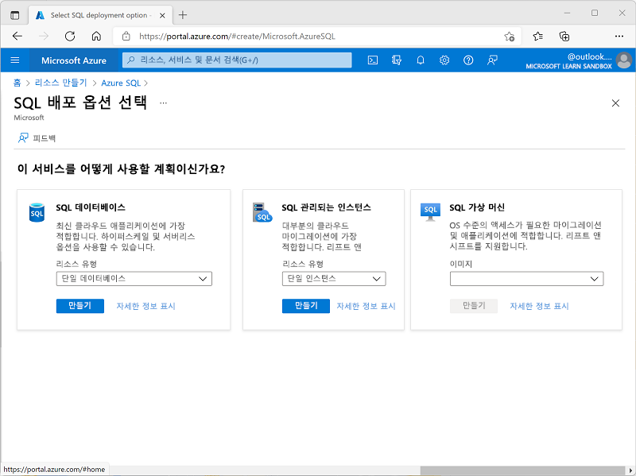
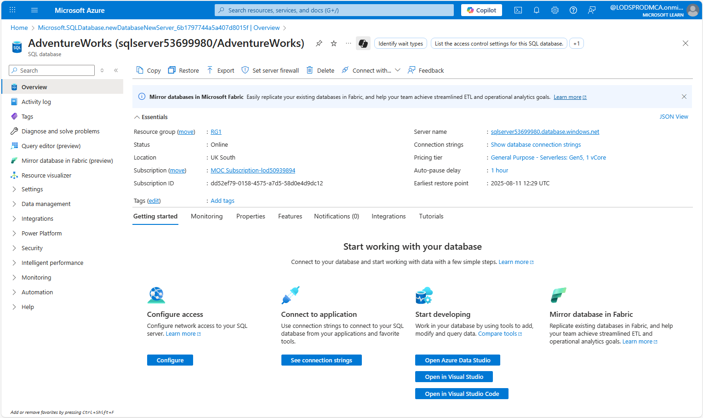
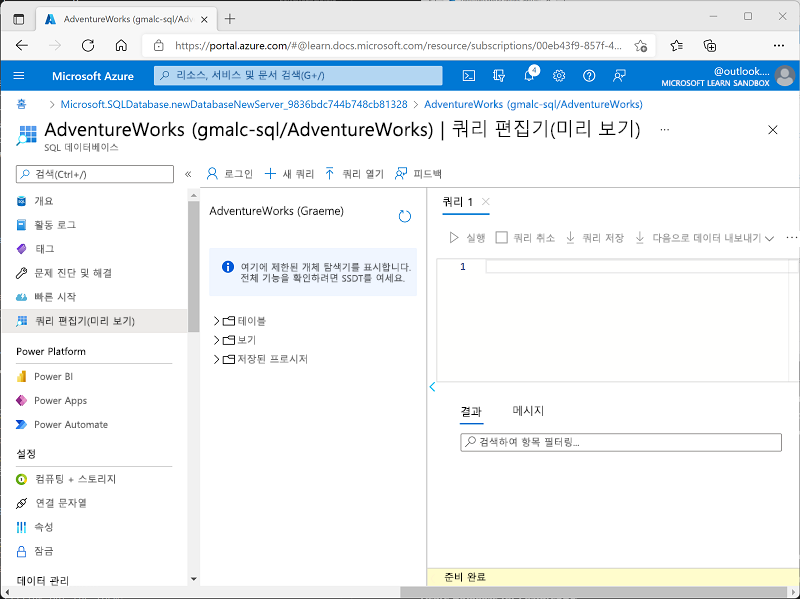
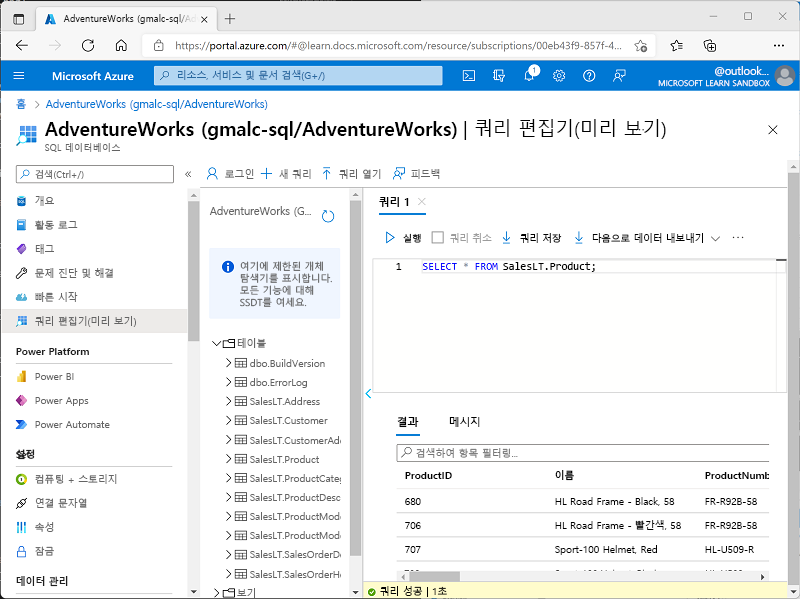

---
lab:
  title: Azure SQL Database 살펴보기
  module: Explore relational data in Azure
---

# Azure SQL Database 살펴보기

이 랩에서는 Azure SQL Database를 프로비전하고 SQL 쿼리를 사용하여 상호 작용하는 방법을 알아봅니다. 미리 채워진 테이블과 데이터를 제공하는 Microsoft AdventureWorks 예제 데이터베이스를 사용하면 사용자 고유의 스키마를 만들거나 샘플 레코드를 삽입하지 않고도 관계형 데이터를 탐색하고 쿼리하는 데 집중할 수 있습니다. 이 방법을 사용하면 작업을 간단하게 유지하고 핵심 데이터베이스 개념 및 SQL 구문을 이해하는 데 집중할 수 있습니다.

이 랩을 완료하는 데 약 **15**분이 걸립니다.

## 시작하기 전에

관리 수준 액세스 권한이 있는 [Azure 구독](https://azure.microsoft.com/free)이 필요합니다.

## Azure SQL Database 리소스 프로비저닝하기

1. [Azure Portal](https://portal.azure.com?azure-portal=true)에서 왼쪽 상단 모서리에 있는 **&#65291; 리소스 만들기**를 선택하고 `Azure SQL`을 검색합니다. 그런 다음 표시되는 **Azure SQL** 페이지에서 **만들기**를 선택합니다.

    

1. 사용 가능한 Azure SQL 옵션을 검토한 다음 **SQL 데이터베이스** 타일에서 **단일 데이터베이스**가 선택되어 있는지 확인하고 **만들기**를 선택합니다.

    

    > _**팁**: 이 랩에서는 단일 데이터베이스를 설정하는 것이 가장 간단하고 빠릅니다. 다른 옵션은 아직 필요하지 않은 설정을 추가합니다._

1. 다음 값을 **SQL 데이터베이스 만들기** 페이지에 입력하고, 다른 속성은 모두 기본값을 유지합니다.
    - **구독**: Azure 구독을 선택합니다.
    - **리소스 그룹**: 선택한 이름으로 새 리소스 그룹을 만듭니다.
    - **데이터베이스 이름**: `AdventureWorks`
    - **서버**: **새로 만들기**를 선택하고 사용 가능한 위치에 고유한 이름으로 새 서버를 만듭니다. **SQL 인증**을 사용하고 서버 관리자 로그인으로 본인의 이름을, 암호로 적당히 복잡한 암호를 지정합니다. (암호는 뒤에서 필요하니 기억해 두세요.)
    - **SQL 탄력적 풀을 사용하기 원하시나요?** *아니요*
    - **워크로드 환경**: 개발
    - **컴퓨팅 + 스토리지**: 그대로 두기
    - **백업 스토리지 중복**: *로컬 중복 백업 스토리지*

    > _**팁**: SQL 인증은 마지막 단계에서 빠르게 설정할 수 있습니다(추가 Microsoft Entra ID 단계 없음). 개발 기본값은 저렴하고 빠릅니다. 로컬 백업은 적은 비용으로 임시 연습 데이터베이스에 적합합니다._

1. **SQL 데이터베이스 만들기** 페이지에서 **다음: 네트워킹 >** 을 선택하고 **네트워킹** 페이지의 **네트워크 연결** 섹션에서 **퍼블릭 엔드포인트**를 선택합니다. 그런 다음 **방화벽 규칙** 섹션의 두 가지 옵션에 대해 **예**를 선택하여 Azure 서비스와 현재 클라이언트 IP 주소에서 데이터베이스 서버에 액세스할 수 있도록 허용합니다.

    

    > _**팁**: 공용 엔드포인트 + IP를 허용하면 즉시 연결할 수 있습니다. 짧은 랩에 적합합니다. 실제 프로젝트에서는 일반적으로 더 많은 액세스를 잠급니다._

1. **다음: 보안 >** 을 선택하고 **Microsoft Defender for SQL 사용** 옵션을 **나중에**로 설정합니다.

    > _**팁**: Defender는 유료 보안 추가 기능입니다. 신속하게 진행하고, 간단한 연습에 비용을 절감하기 위해 이 부분을 건너뜁니다._

1. **다음: 추가 설정 >** 을 선택하고 **추가 설정** 탭에서 **기존 데이터 사용** 옵션을 **샘플**로 설정합니다. (이렇게 하면 나중에 살펴볼 수 있는 샘플 데이터베이스가 만들어집니다.)

    > _**팁**: 샘플 데이터는 즉시 쿼리를 시작할 수 있도록 준비된 테이블과 행을 제공합니다._

1. **검토 + 만들기**를 선택하고 **만들기**를 선택하여 Azure SQL Database를 만듭니다.

1. 배포가 완료될 때까지 기다립니다. 그런 다음 배포된 리소스로 이동합니다. 리소스의 모습은 다음과 같습니다.

    

1. 페이지 왼쪽 창에서 **쿼리 편집기(미리 보기)** 를 선택한 다음 서버에 대해 지정한 관리자 로그인과 암호를 사용하여 로그인합니다.
    
    >**참고**: 클라이언트 IP 주소가 허용되지 않는다는 오류 메시지가 표시되는 경우 메시지 끝에 있는 **허용 목록 IP...** 링크를 선택하여 액세스를 허용한 후 다시 로그인해 봅니다. (앞에서 컴퓨터의 클라이언트 IP 주소를 방화벽 규칙에 추가했으나, 네트워크 구성에 따라 쿼리 편집기가 다른 주소에서 연결할 수 있습니다.)
    
    쿼리 편집기의 모습은 다음과 같습니다.
    
    

1. **Tables** 폴더를 확장하여 데이터베이스에서 테이블을 봅니다.

1. **쿼리 1** 창에 다음 SQL 코드를 입력합니다.

    ```sql
   SELECT * FROM SalesLT.Product;
    ```

    > _**팁**: SELECT * 모든 열과 일부 값을 빠르게 표시합니다. (실제 앱에서는 일반적으로 이를 피하고 필요한 열만 선택합니다.)_

1. 쿼리 위의 **&#9655; 실행**을 선택하여 쿼리를 실행하고 결과를 봅니다. 결과에는 다음과 같이 **SalesLT.Product** 테이블의 모든 행에 대한 모든 열이 포함됩니다.

    

1. SELECT 문을 다음 코드로 바꾼 다음 **&#9655; 실행**을 선택하여 새 쿼리를 실행하고 결과를 봅니다. (결과에는 **ProductID**, **Name**, **ListPrice**, **ProductCategoryID** 열만 포함됩니다.)

    ```sql
   SELECT ProductID, Name, ListPrice, ProductCategoryID
   FROM SalesLT.Product;
    ```

    > _**팁**: 필요한 열만 나열하면 결과가 더 작게 유지되고 더 빠르게 실행할 수 있습니다._

1. 이번에는 JOIN을 사용하여 **SalesLT.ProductCategory** 테이블에서 범주 이름을 가져오는 다음 쿼리를 실행해 봅니다.

    ```sql
    SELECT 
        p.ProductID, 
        p.Name AS ProductName,
        c.Name AS Category, 
        p.ListPrice
    FROM SalesLT.Product AS p
    INNER JOIN SalesLT.ProductCategory AS c 
        ON p.ProductCategoryID = c.ProductCategoryID;
    ```

    > _**팁**: JOIN은 일치하는 ID를 사용하여 다른 테이블에서 관련 데이터(범주 이름)를 가져오는 방법을 보여 줍니다._

1. 쿼리 편집기 창을 닫고 편집 내용을 삭제합니다.

> _**팁**: Azure SQL Database 탐색을 완료하면 이 연습에서 만든 리소스 그룹을 삭제할 수 있습니다. 리소스 그룹을 삭제하면 한 번에 모든 리소스가 제거됩니다. 또한 비용을 최소화합니다._
