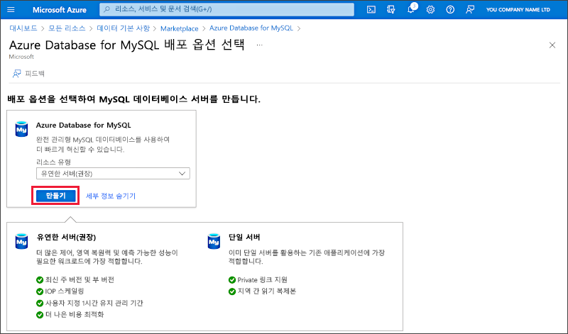
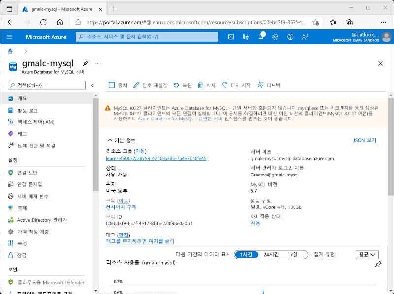

---
lab:
  title: Azure Database for MySQL 살펴보기
  module: Explore relational data in Azure
---

# Azure Database for MySQL 살펴보기

이 연습에서는 Azure 구독에서 Azure Database for MySQL 리소스를 프로비저닝합니다.

이 랩을 완료하는 데 약 **5**분이 걸립니다.

## 시작하기 전에

관리 수준 액세스 권한이 있는 [Azure 구독](https://azure.microsoft.com/free)이 필요합니다.

## Azure Database for MySQL 리소스 프로비저닝하기

이 연습에서는 Azure Database for MySQL 리소스를 프로비저닝해 봅니다.

1. In the Azure portal, select <bpt id="p1">**</bpt>&amp;#65291; Create a resource<ept id="p1">**</ept> from the upper left-hand corner and search for <bpt id="p2">*</bpt>Azure Database for MySQL<ept id="p2">*</ept>. Then in the resulting <bpt id="p1">**</bpt>Azure Database for MySQL<ept id="p1">**</ept> page, select <bpt id="p2">**</bpt>Create<ept id="p2">**</ept>.

1. Review the Azure Database for MySQL options that are available. Then for <bpt id="p1">**</bpt>Resource type<ept id="p1">**</ept>, select <bpt id="p2">**</bpt>Flexible Server<ept id="p2">**</ept> and select <bpt id="p3">**</bpt>Create<ept id="p3">**</ept>.

    

1. **SQL Database 만들기** 페이지에서 다음과 같은 값을 입력합니다.
    - **구독**: Azure 구독을 선택합니다.
    - **리소스 그룹**: 선택한 이름으로 새 리소스 그룹을 만듭니다.
    - **서버 이름**: 고유한 이름을 입력합니다.
    - **지역**: 가까운 모든 사용 가능한 위치입니다.
    - **MySQL 버전**: 변경하지 않은 상태로 유지합니다.
    - **워크로드 유형**: 개발 또는 취미 프로젝트용입니다.
    - **컴퓨팅 + 스토리지**: 변경하지 않은 상태로 유지합니다.
    - **가용성 영역**: 변경하지 않은 상태로 유지합니다.
    - **고가용성 사용**: 변경하지 않은 상태로 유지합니다.
    - **관리자 사용자 이름**: 본인의 이름
    - **암호** 및 **암호 확인**: 적당히 복잡한 암호

1. 완료되면 **다음: 네트워킹**을 선택합니다.

1. **방화벽 규칙** 아래에서 **&#65291; 현재 클라이언트 IP 주소 추가**를 선택합니다.

1. **검토 + 만들기**를 선택하고 **만들기**를 선택하여 Azure MySQL 데이터베이스를 만듭니다.

1. Wait for deployment to complete. Then go to the resource that was deployed, which should look like this:

    

1. Azure Database for MySQL 리소스를 관리하는 데 사용할 수 있는 옵션을 검토합니다.

> **팁**: Azure Database for MySQL 탐색을 완료하면 이 연습에서 만든 리소스 그룹을 삭제할 수 있습니다.
