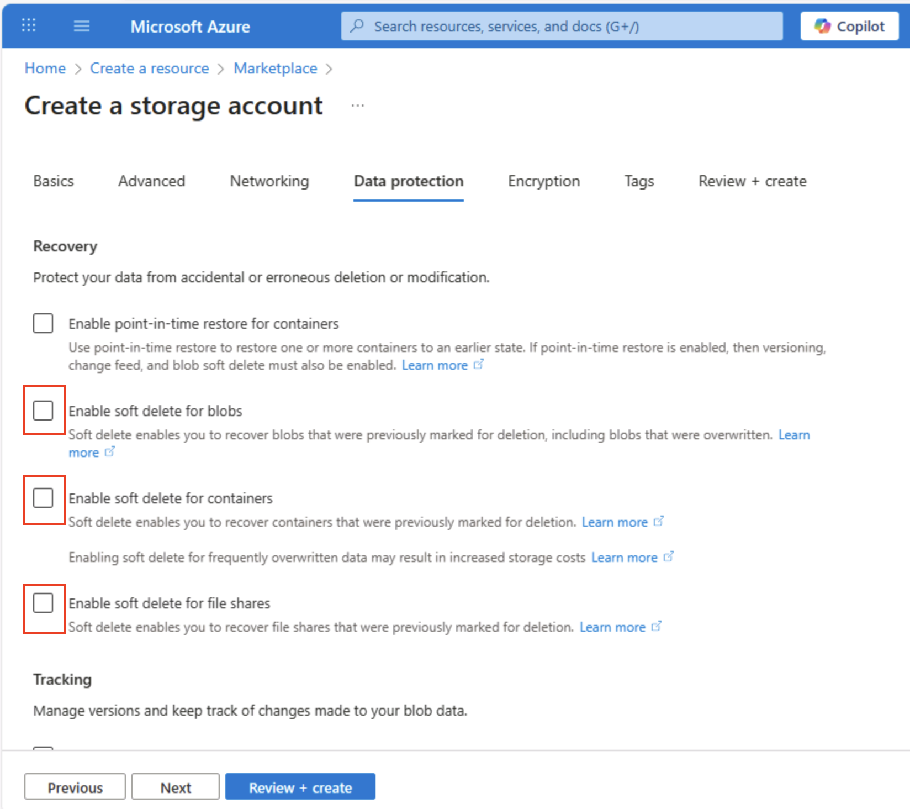
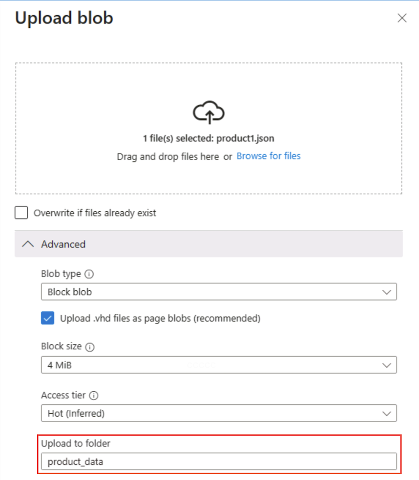

---
lab:
  title: Azure Storage 살펴보기
  module: Explore Azure Storage for non-relational data
---

# Azure Storage 살펴보기

이 연습에서는 Azure Storage 계정을 프로비전 및 구성하고 핵심 서비스를 탐색하는 방법을 알아봅니다. Blob Storage, Data Lake Storage Gen2, Azure Files 및 Azure 테이블. 컨테이너 만들기, 데이터 업로드, 계층 구조 네임스페이스를 사용하도록 설정, 파일 공유 설정, 테이블 엔터티 관리 등에 대한 실습 경험을 얻을 수 있습니다. 이러한 기술은 다양한 분석 및 애플리케이션 시나리오를 위해 Azure에서 비관계형 데이터를 저장, 구성 및 보호하는 방법을 이해하는 데 도움이 됩니다.

이 랩을 완료하는 데 약 **15**분이 걸립니다.

> _**팁**: 각 작업의 목적을 이해하면 나중에 비용, 성능, 보안 및 분석 목표의 균형을 맞추는 스토리지 솔루션을 설계할 수 있습니다. 이 간략한 이유 노트는 각 단계를 실제 이유와 연결합니다._

## 시작하기 전에

관리 수준 액세스 권한이 있는 [Azure 구독](https://azure.microsoft.com/free)이 필요합니다.

## Azure Storage 계정 프로비전

Azure Storage를 사용하는 첫 번째 단계는 Azure 구독에서 Azure Storage 계정을 프로비전하는 것입니다.

> _**팁**: 스토리지 계정은 모든 Azure Storage 서비스(Blob, 파일, 큐, 테이블)에 대한 안전하고 청구 가능한 경계입니다. 정책, 중복도, 암호화, 네트워킹 및 액세스 제어가 여기에서 아래쪽으로 적용됩니다._

1. 아직 로그인하지 않은 경우 [Azure Portal](https://portal.azure.com?azure-portal=true)에 로그인합니다.

1. Azure Portal 홈페이지에서, 왼쪽 상단 모서리에 있는 **&#65291; 리소스 만들기**를 선택하고 `Storage account`을(를) 검색합니다. 그런 다음 결과 **스토리지 계정** 페이지에서 **만들기**를 선택합니다.

    

1. **스토리지 계정 만들기** 페이지에서 다음 값을 입력합니다.
   
    - **구독**: Azure 구독을 선택합니다.
    - **리소스 그룹**: 선택한 이름으로 새 리소스 그룹을 만듭니다.
    - **스토리지 계정 이름**: 소문자 및 숫자를 사용하여 스토리지 계정의 고유한 이름을 입력합니다.
    - **지역**: 사용 가능한 지역을 선택합니다.
    - **성능**: *표준*
    - **중복도**: *LRS(로컬 중복 스토리지)*

    

    > _**팁**: 새로운 리소스 그룹을 사용하면 쉽게 정리할 수 있습니다. 표준 + LRS는 가장 저렴한 기준선으로 학습에 적합합니다. LRS는 지역 복제에 비용을 지불하지 않고도 중요하지 않은 데모 데이터에 적합한 세 개의 동기 복사본을 한 지역에 보관합니다._

1. **다음: 고급 >** 을 선택하고 구성 옵션을 검토합니다. 특히, Azure Data Lake Storage Gen2를 지원하려면 여기서 계층 구조 네임스페이스를 사용하도록 설정할 수 있습니다. 이 옵션을 **<u>선택 취소</u>** 된 상태로 두고(나중에 사용하도록 설정) **다음: 네트워킹 >** 을 선택하여 스토리지 계정의 네트워킹 옵션을 확인합니다.
   
   

1. **다음: 데이터 보호 >** 를 선택한 다음 **복구** 섹션에서 **일시 삭제 사용...** 옵션을 모두 선택 <u>취소</u>합니다. 이러한 옵션은 이후의 복구를 위해 삭제된 파일을 유지하지만 나중에 계층 구조 네임스페이스를 사용하도록 설정하면 문제가 발생할 수 있습니다.

    

1. 기본 설정을 변경하지 않고 나머지 **다음 >** 페이지를 계속 진행한 다음 **검토** 페이지에서 선택 항목의 유효성이 검사될 때까지 기다렸다가 **만들기**를 선택하여 Azure Storage 계정을 만듭니다.

1. 배포가 완료될 때까지 기다립니다. 그런 다음 배포된 리소스로 이동합니다.

## Blob 스토리지 살펴보기

이제 Azure Storage 계정이 있으므로 Blob 데이터용 컨테이너를 만들 수 있습니다.

> _**팁**: 컨테이너는 Blob을 그룹화하고 액세스 제어를 위한 첫 번째 범위 지정 수준입니다. 일반 Blob Storage(계층 구조 네임스페이스 없음)로 시작하면 나중에 Data Lake Gen2와 비교할 가상 폴더 동작이 표시됩니다._

1. `https://aka.ms/product1.json`에서 [product1.json](https://aka.ms/product1.json?azure-portal=true) JSON 파일을 다운로드하여 컴퓨터에 저장합니다(나중에 Blob 스토리지에 업로드할 것이므로 임의의 폴더에 저장할 수 있음).

    *JSON 파일이 브라우저에 표시되는 경우 페이지를 **product1.json**으로 저장합니다.*

1. 스토리지 컨테이너에 대한 Azure Portal 페이지의 왼쪽에 있는 **데이터 스토리지** 섹션에서 **컨테이너**를 선택합니다.
   
    

1. **컨테이너** 페이지에서 **&#65291; 컨테이너 추가**를 선택하고 익명 액세스 수준이 **비공개(익명 액세스 불가)** 인 `data`라는 이름의 새 컨테이너를 추가합니다.

    

    > _**팁**: 프라이빗은 샘플 데이터를 안전하게 유지합니다. 정적 웹 사이트 또는 오픈 데이터 시나리오를 제외하고는 공용 액세스가 거의 필요하지 않습니다. 이름을 `data`로(으로) 지정하면 이 예제가 간단해지고 읽기 쉬워집니다._

1. **data** 컨테이너가 만들어지면 **컨테이너** 페이지에 나열되는지 확인합니다.

1. 왼쪽 창의 맨 위 섹션에서 **스토리지 브라우저**를 선택합니다. 이 페이지에서는 스토리지 계정의 데이터에 대한 작업에 사용할 수 있는 브라우저 기반 인터페이스를 제공합니다.

1. 스토리지 브라우저 페이지에서 **Blob 컨테이너**를 선택하고 **data** 컨테이너가 나열되는지 확인합니다.

1. **data** 컨테이너를 선택합니다. 이 컨테이너는 비어 있습니다.

    

1. **&#65291; 디렉터리 추가**를 선택하고, `products`라는 새 디렉터리를 만들기 전에 폴더에 대한 정보를 읽습니다.

1. 스토리지 브라우저에서 현재 보기에 방금 만든 **products** 폴더의 내용이 표시되는지 확인합니다. 페이지 맨 위에 있는 “이동 경로”에 **Blob containers > data > products** 경로가 반영되는지 확인합니다.

    

1. 이동 경로에서 **data**를 선택하여 **data** 컨테이너로 전환합니다. 여기에 **products**라는 폴더는 포함되어 있지 <u>않습니다</u>.

    Blob 스토리지의 폴더는 가상이며 Blob 경로의 일부로만 존재합니다. **products** 폴더에 Blob이 없으므로 실제로 존재하지 않는 것입니다.

    > _**팁**: 단일 구조 네임스페이스는 디렉토리가 단지 이름 접두사(products/file.json)일 뿐이라는 것을 의미합니다. 이 디자인은 서비스가 실제 트리 구조를 유지하는 대신 Blob 이름을 인덱싱하기 때문에 대규모 확장이 가능합니다._

1. **&#10514; 업로드** 단추를 사용하여 **Blob 업로드** 패널을 엽니다.

1. **Blob 업로드** 패널에서 이전에 로컬 컴퓨터에 저장한 **product1.json** 파일을 선택합니다. 그런 다음 **고급** 섹션의 **폴더에 업로드** 상자에 `product_data`를 입력하고 **업로드** 단추를 선택합니다.

    

    > _**팁**: 자동으로 업로드하는 동안 폴더 이름을 제공하면 가상 경로가 만들어집니다. Blob이 있으면 "폴더"가 나타납니다._

1. 아직 열려 있으면 **Blob 업로드** 패널을 닫고 **data** 컨테이너에 **product_data** 가상 폴더가 만들어졌는지 확인합니다.

1. **product_data** 폴더를 선택하고 업로드한 **product1.json** Blob이 포함되어 있는지 확인합니다.

1. 왼쪽의 **데이터 스토리지** 섹션에서 **컨테이너**를 선택합니다.

1. **data** 컨테이너를 열고 방금 만든 **product_data** 폴더가 나열되는지 확인합니다.

1. 폴더의 오른쪽 끝에 있는 **&#x2027;&#x2027;&#x2027;** 아이콘을 선택합니다(아무 옵션도 표시되지 않음). 단일 구조 네임스페이스 Blob 컨테이너의 폴더는 가상이며 관리할 수 없습니다.

    

    > _**팁**: 실제 디렉터리 개체가 없으므로 이름 바꾸기/사용 권한 작업이 없으므로 계층 구조 네임스페이스가 필요합니다._

1. **data** 페이지의 오른쪽 위에 있는 **X** 아이콘을 사용하여 페이지를 닫고 **컨테이너** 페이지로 돌아갑니다.

## Azure Data Lake Storage Gen2 살펴보기

Azure Data Lake Store Gen2 지원을 사용하면 계층적 폴더를 사용하여 Blob에 대한 액세스를 구성하고 관리할 수 있습니다. 또한 Azure Blob Storage를 사용하여 일반적인 빅 데이터 분석 플랫폼의 분산 파일 시스템을 호스트할 수 있습니다.

> _**팁**: 계층 구조 네임스페이스를 켜면 폴더가 실제 디렉터리처럼 동작합니다. 또한 이를 통해 폴더 작업을 안전하게(오류 없이 한 번에) 수행할 수 있으며 Linux와 유사한 파일 사용 권한 컨트롤 기능을 제공합니다. 이 기능은 Spark나 Hadoop과 같은 빅데이터 도구를 사용하거나 대규모의 구성된 데이터 레이크를 관리할 때 특히 유용합니다._

1. `https://aka.ms/product2.json`에서 [product2.json](https://aka.ms/product2.json?azure-portal=true) JSON 파일을 다운로드하여 이전에 **product1.json**을 다운로드한 컴퓨터의 폴더에 저장합니다(나중에 Blob Storage에 업로드함).

1. 스토리지 계정에 대한 Azure Portal 페이지의 왼쪽에서 **설정** 섹션까지 아래로 스크롤하고 **Data Lake Gen2 업그레이드**를 선택합니다.

    

1. **Data Lake Gen2 업그레이드** 페이지에서 각 단계를 확장 및 완료하여 계층 구조 네임스페이스를 사용하고 Azure Data Lake Storage Gen을 지원하도록 스토리지 계정을 업그레이드합니다. 이 작업에는 약간의 시간이 걸릴 수 있습니다.

    

    > _**팁**: 업그레이드는 계정 수준 기능 스위치입니다. 데이터는 남아 있지만 디렉터리 의미 체계는 고급 작업을 지원하도록 변경됩니다._

1. 업그레이드가 완료되면 왼쪽 창의 맨 위 섹션에서 **스토리지 브라우저**를 선택하고 여전히 **product_data** 폴더가 포함된 **data** Blob 컨테이너의 루트로 다시 이동합니다.

1. **product_data** 폴더를 선택하고 이전에 업로드한 **product1.json** 파일이 여전히 포함되어 있는지 확인합니다.

1. **&#10514; 업로드** 단추를 사용하여 **Blob 업로드** 패널을 엽니다.

1. **Blob 업로드** 패널에서 로컬 컴퓨터에 저장한 **product2.json** 파일을 선택합니다. 그런 다음 **업로드** 단추를 선택합니다.

1. 아직 열려 있으면 **Blob 업로드** 패널을 닫고 **product_data** 폴더에 **product2.json** 파일이 포함되어 있는지 확인합니다.

    

    > _**팁**: 업그레이드 후 두 번째 파일을 추가하면 원활한 연속성이 확인됩니다. 기존 Blob은 여전히 작동하며, 새 Blob은 디렉터리 ACL(액세스 제어 목록)과 같은 계층적 이점을 얻습니다._

1. 왼쪽의 **데이터 스토리지** 섹션에서 **컨테이너**를 선택합니다.

1. **data** 컨테이너를 열고 방금 만든 **product_data** 폴더가 나열되는지 확인합니다.

1. 폴더의 오른쪽 끝에 있는 **&#x2027;&#x2027;&#x2027;** 아이콘을 선택합니다. 계층 구조 네임스페이스를 사용하도록 설정하면 폴더 수준에서 폴더 이름 바꾸기, 권한 설정 등의 구성 작업을 수행할 수 있습니다.

    

    > _**팁**: 실제 폴더를 사용하면 폴더 세분성에서 최소 권한 보안을 적용하고, 안전하게 이름을 변경하고, 재귀 목록을 빠르게 실행하고, 접두사 Blob 이름을 수천 개 검색할 수 있습니다._

1. **data** 페이지의 오른쪽 위에 있는 **X** 아이콘을 사용하여 페이지를 닫고 **컨테이너** 페이지로 돌아갑니다.

## Azure Files 살펴보기

Azure Files는 클라우드 기반 파일 공유를 만드는 방법을 제공합니다.

> _**팁**: Azure Files는 앱이 기존 파일 시스템을 기대하는 리프트 앤 시프트 시나리오에 대한 SMB/NFS 엔드포인트를 제공합니다. 파일 잠금 및 OS 네이티브 툴링을 지원하여 Blob Storage를 보완합니다(대체하는 것이 아닙니다)._

1. 스토리지 컨테이너에 대한 Azure Portal 페이지의 왼쪽에 있는 **데이터 스토리지** 섹션에서 **파일 공유**를 선택합니다.

    

1. 파일 공유 페이지에서 **&#65291; 파일 공유**를 선택하고 **트랜잭션 최적화** 계층을 사용하여 `files`라는 새 파일 공유를 추가합니다.

1. **다음: 백업 >** 을 선택하고 백업을 사용 중지합니다. 그런 다음 **검토 + 만들기**를 선택합니다.

    

    > _**팁**:  백업을 사용하지 않도록 설정하면 수명이 짧은 랩 환경의 비용을 절감할 수 있습니다. 이를 통해 프로덕션 복원력을 유지할 수 있습니다._

1. **파일 공유**에서 새 **files** 공유를 엽니다.

1. 페이지 위쪽에서 **연결**을 선택합니다. 그러면 **연결** 창에는 클라이언트 컴퓨터에서 공유 폴더에 연결하기 위해 실행할 수 있는 스크립트가 포함된 일반 운영 체제(Windows, Linux 및 macOS)용 탭이 있습니다.

    

    > _**팁**: 생성된 스크립트는 플랫폼 네이티브 명령을 사용하여 공유를 탑재하는 방법을 정확하게 보여 줍니다. 가상 머신, 컨테이너 또는 온-프레미스 서버의 하이브리드 액세스 패턴을 보여 줍니다._

1. **연결** 창을 닫은 다음 **files** 페이지를 닫아 Azure Storage 계정의 **파일 공유** 페이지로 돌아갑니다.

## Azure Tables 살펴보기

Azure 테이블은 데이터 값을 저장해야 하지만 관계형 데이터베이스의 전체 기능 및 구조가 필요하지 않은 애플리케이션에 키/값 저장소를 제공합니다.

> _**팁**: Table Storage는 매우 저렴한 비용, 스키마 없는 유연성 및 수평적 크기 조정을 위해 풍부한 쿼리 및 조인을 거래하며 로그, IoT 데이터 또는 사용자 프로필에 적합합니다._

1. 스토리지 컨테이너에 대한 Azure Portal 페이지의 왼쪽에 있는 **데이터 스토리지** 섹션에서 **테이블**을 선택합니다.

    

1. **테이블** 페이지에서 **&#65291; 테이블**을 선택하고 `products`라는 새 테이블을 만듭니다.

1. **products** 테이블이 만들어졌으면 왼쪽 창의 맨 위 섹션에서 **스토리지 브라우저**를 선택합니다.

1. 스토리지 탐색기에서 **테이블**을 선택하고 **products** 테이블이 나열되는지 확인합니다.

1. **products** 테이블을 선택합니다.

1. **products** 페이지에서 **&#65291; 엔터티 추가**를 선택합니다.

1. **엔터티 추가** 패널에서 다음 키 값을 입력합니다.
    - **PartitionKey**: 1
    - **RowKey**: 1

    > _**팁**: PartitionKey는 관련 엔터티를 그룹화하여 부하를 분산하고, RowKey는 파티션 내에서 고유하게 식별합니다. 이러한 키는 함께 조회를 위한 빠른 복합 기본 키를 형성합니다._

1. **속성 추가**를 선택하고 다음 값을 사용하여 두 개의 새 속성을 만듭니다.

    |Property name | Type | 값 |
    | ------------ | ---- | ----- |
    | 속성 | 문자열 | 위젯 |
    | 가격 | 두 배 | 2.99 |

    

1. **삽입**을 선택하여 새 엔터티에 대한 행을 테이블에 삽입합니다.

1. 스토리지 브라우저에서 행이 **products** 테이블에 추가되었는지, 행이 마지막으로 수정된 시기를 나타내는 **타임스탬프** 열이 만들어졌는지 확인합니다.

1. 다음 속성을 사용하여 **products** 테이블에 다른 엔터티를 추가 합니다.

    |Property name | Type | 값 |
    | ------------ | ---- | ----- |
    | PartitionKey | 문자열 | 1 |
    | RowKey | 문자열 | 2 |
    | 이름 | 문자열 | Kniknak |
    | 가격 | 두 배 | 1.99 |
    | 단종 | Boolean | true |

    > _**팁**: 다른 키와 추가 부울 속성을 사용하여 두 번째 엔터티를 추가하면 쓰기 시 스키마 유연성이 표시됩니다. 새 특성에는 마이그레이션이 필요하지 않습니다._

1. 새 엔터티를 삽입한 후 중단된 제품이 포함된 행이 테이블에 표시되는지 확인합니다.

    스토리지 브라우저 인터페이스를 사용하여 수동으로 테이블에 데이터를 입력했습니다. 실제 시나리오에서는 애플리케이션 개발자가 Azure Storage Table API를 사용하여 테이블에서 값을 읽고 쓰는 애플리케이션을 빌드할 수 있으므로 NoSQL 스토리지에 대한 비용 효율적이고 확장 가능한 솔루션이 될 수 있습니다.

> _**팁**: Azure Storage 탐색을 완료하면 이 연습에서 만든 리소스 그룹을 삭제할 수 있습니다. 리소스 그룹을 삭제하는 것은 한 작업에서 만든 모든 리소스를 제거하여 지속적인 요금 청구를 방지하는 가장 빠른 방법입니다._
