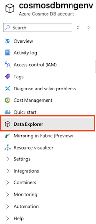
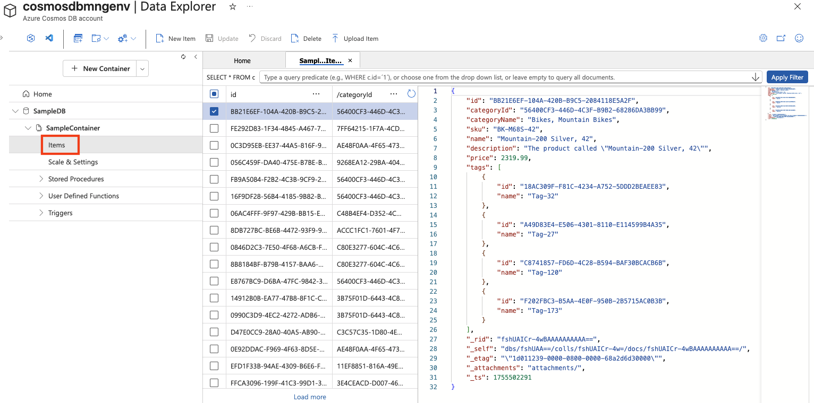

---
lab:
  title: Azure Cosmos DB 살펴보기
  module: Explore fundamentals of Azure Cosmos DB
---
# Azure Cosmos DB 살펴보기

이 랩을 완료하면 Azure Cosmos DB 계정을 프로비전하고, 샘플 데이터베이스 및 컨테이너를 만들고, JSON 항목을 추가 및 보고, SQL과 유사한 쿼리를 실행하여 데이터를 검색하는 방법을 알아봅니다. Azure Portal에서 실습 경험을 쌓고 Cosmos DB가 유연한 비관계형 데이터 스토리지 및 쿼리를 지원하는 방법을 이해합니다.

이 랩을 완료하는 데 약 **15**분이 걸립니다.

## 시작하기 전에

관리 수준 액세스 권한이 있는 [Azure 구독](https://azure.microsoft.com/free)이 필요합니다.

## Cosmos DB 계정 만들기

Cosmos DB를 사용하려면 Azure 구독에서 Cosmos DB 계정을 프로비저닝 해야 합니다. 이 연습에서는 Azure Cosmos DB for NoSQL을 사용하는 Cosmos DB 계정을 프로비저닝합니다.

1. Azure Portal 왼쪽 위에서 **+ 리소스 만들기**를 선택하고 `Azure Cosmos DB`을(를) 검색합니다.  결과에서 **Azure Cosmos DB**를 선택하고 **만들기**를 선택합니다.

    

1. **Azure Cosmos DB for NoSQL** 타일에서 **만들기**를 선택합니다.

    
   
    > _**팁**: 계정은 Cosmos DB 리소스의 최상위 수준입니다. Azure Cosmos DB for NoSQL을 선택하면 간단한 SQL 유사 쿼리 언어로 JSON 데이터를 저장하고 쿼리할 수 있습니다._

1. 다음 세부 정보를 입력한 다음 **검토 + 만들기**를 선택합니다.
   
    - **워크로드 유형**: 학습
    - **구독**: 샌드박스를 사용하고 있다면 *컨시어지 구독*을 선택합니다. 그렇지 않다면 사용자의 Azure 구독을 선택합니다.
    - **리소스 그룹**: 샌드박스를 사용하고 있다면 기존 리소스 그룹을 선택합니다(이름의 예: *learn-xxxx...*). 그렇지 않다면 원하는 이름으로 새 리소스 그룹을 만듭니다.
    - **계정 이름**: 고유한 이름을 입력합니다.
    - **가용성 영역**: 사용 안 함
    - **위치**: 권장 위치 선택
    - **용량 모드**: 프로비저닝된 처리량
    - ** 할인 적용**: 사용 가능한 경우 적용 선택
    - **총 계정 처리량 제한**: 선택하지 않음
  
    > _**이러한 선택 옵션을 사용하는 이유**_
    >
    > _**워크로드 유형**을 학습으로 설정한 이유는 초보자에게 친숙한 기본값이 제공되어 설정이 더 쉽고 비용이 저렴하기 때문입니다. **계정 이름**은 서비스 URL의 일부가 되므로 전체 서비스에서 고유해야 합니다. 테스트를 더 빨리 진행할 수 있도록 가까운 **위치**를 선택합니다. 표시되는 위치는 구독과 특정 가용성 영역이 활성화되어 있는지 여부에 따라 달라집니다. **용량 모드**의 경우 프로비전된 처리량을 사용하여 짧은 랩 동안 성능을 예측할 수 있습니다. 하지만 가끔 필요한 경우 서버리스로도 충분할 수 있습니다. **무료 계층**이 제공되는 경우, 요금을 청구하지 않고도 실험해 볼 수 있도록 무료 계층을 사용하겠습니다. 마지막으로, 작업하는 동안 예기치 않게 속도가 느려지는 일이 없도록 "**총 계정 처리량 제한**" 설정을 꺼두었습니다._

1. 구성의 유효성이 검사되면 **만들기**를 선택합니다.

    > _**팁**: Azure Portal은 이 CosmosDB 인스턴스를 프로비전하는 데 걸리는 시간을 추정합니다. 예상 생성 시간은 선택한 위치를 기준으로 계산됩니다._

1. 배포가 완료될 때까지 기다립니다. 그런 다음, 배포된 리소스로 이동합니다.

## 샘플 데이터베이스 만들기

*이 프로시저에서 포털에 표시되는 팁을 닫습니다*.

1. 새 Cosmos DB 계정 페이지 왼쪽 창에서 **데이터 탐색기**를 선택합니다.

    

1. **데이터 탐색기** 페이지에서 **빠른 시작 실행**을 선택합니다.

    > _**팁**: 스키마를 먼저 디자인하지 않고 항목을 추가하고 쿼리하는 연습을 수행할 수 있도록 작업 중인 데이터베이스, 컨테이너 및 샘플 데이터를 빠르게 시작합니다._

1. **새 컨테이너** 탭에서 샘플 데이터베이스에 미리 채워진 설정을 검토한 다음 **확인**을 선택합니다.

1. **SampleDB** 데이터베이스와 **SampleContainer** 컨테이너가 생성될 때까지(1분 정도 걸릴 수 있음) 화면 하단에 있는 창에서 상태를 관찰합니다.

## 항목 보기 및 만들기

1. 데이터 탐색기 페이지에서 **SampleDB** 데이터베이스와 **SampleContainer** 컨테이너를 확장하고 **항목**을 선택하여 컨테이너의 항목 목록을 확인합니다. 항목은 제품 데이터를 나타내며 각각 고유한 ID와 기타 속성을 갖습니다.

    

1. 목록에서 항목을 선택하여 항목 데이터의 JSON 표현을 확인합니다.

1. 페이지 맨 위에서 **새 항목**을 선택하여 새 빈 항목을 만듭니다.

1. 다음과 같이 새 항목에 대한 JSON을 수정한 다음 **저장**을 선택합니다.

    ```json
   {
       "name": "Road Helmet,45",
       "id": "123456789",
       "categoryID": "123456789",
       "SKU": "AB-1234-56",
       "description": "The product called \"Road Helmet,45\" ",
       "price": 48.74
   }
    ```

    

1. 새 항목을 저장하면 추가 메타데이터 속성이 자동으로 추가됩니다.

    > _**팁**: Cosmos DB는 항목을 JSON(JavaScript Object Notation)으로 저장하므로 엄격한 스키마 없이 시나리오에 맞는 필드를 추가할 수 있습니다. `id`은(는) 컨테이너 내에서 고유해야 합니다. 저장 후 Cosmos DB는 데이터 관리 및 최적화를 돕기 위해 시스템 속성(타임스탬프 및 내부 식별자 등)을 추가합니다._
    > - *_rid — Cosmos DB에서 항목을 내부적으로 식별하는 데 사용하는 내부 리소스 ID입니다.*
    > - *_self — 항목에 대한 전체 리소스 링크입니다.*
    > - *_etag — 낙관적 동시성 검사에 사용되는 엔터티 태그입니다.*
    > - *_ts — 항목이 마지막으로 수정된 Unix 타임스탬프(초)입니다.*
    > - *_attachments — 문서의 첨부 파일(있는 경우)에 대한 링크입니다.*

## 데이터베이스 쿼리

1. **데이터 탐색기** 페이지에서 **새 SQL 쿼리** 아이콘을 선택합니다.

    

1. SQL 쿼리 편집기에서 기본 쿼리(`SELECT * FROM c`)를 검토하고 **쿼리 실행** 단추를 사용하여 실행합니다.

1. 모든 항목의 전체 JSON 표현을 포함하는 결과를 검토합니다.

1. 쿼리를 다음과 같이 수정합니다.

    ```sql
   SELECT *
   FROM c
   WHERE CONTAINS(c.name,"Helmet")
    ```

    > _**팁**: NoSQL API는 친숙한 SQL과 유사한 쿼리를 사용하여 JSON 문서를 검색합니다. `SELECT * FROM c` 모든 항목을 나열하고 `CONTAINS` 속성 내의 텍스트로 필터링합니다. 추가 설정 없이 빠른 검색에 유용합니다._

1. **쿼리 실행** 단추를 사용하여 수정된 쿼리를 실행하고 결과를 검토합니다. 여기에는 **이름** 필드에 "Helmet"이라는 텍스트가 포함된 항목의 JSON 엔터티가 포함됩니다.

    

1. SQL 쿼리 편집기를 닫고 변경 내용을 삭제합니다.

    Azure Portal에서 데이터 탐색기 인터페이스를 사용하여 Cosmos DB 데이터베이스에서 JSON 엔터티를 만들고 쿼리하는 방법을 살펴보았습니다. 실제 시나리오에서 애플리케이션 개발자는 많은 프로그래밍 언어 SDK(소프트웨어 개발 키트) 중 하나를 사용하여 NoSQL API를 호출하고 데이터베이스의 데이터를 사용합니다.

> _**팁**: Azure Cosmos DB 탐색을 완료하면 이 연습에서 만든 리소스 그룹을 삭제할 수 있습니다._
