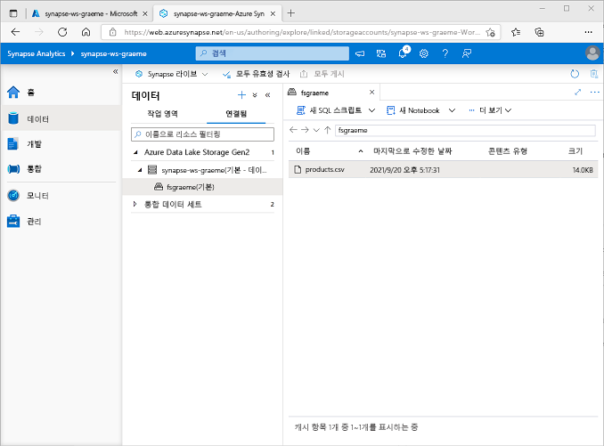
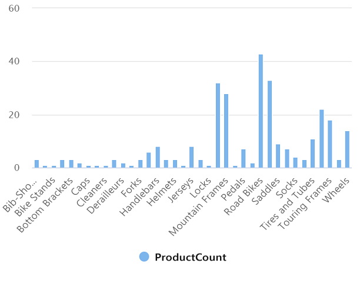
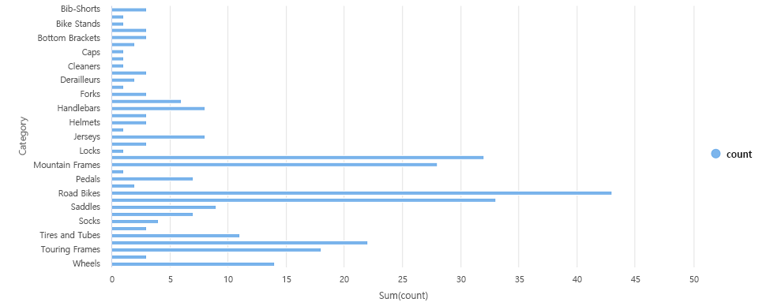

---
lab:
  title: Azure Synapse Analytics를 사용하여 Azure에서 데이터 분석 살펴보기
  module: Explore fundamentals of large-scale data warehousing
---

# <a name="explore-data-analytics-in-azure-with-azure-synapse-analytics"></a>Azure Synapse Analytics를 사용하여 Azure에서 데이터 분석 살펴보기

이 연습에서는 Azure 구독에서 Azure Synapse Analytics 작업 영역을 프로비저닝하고 이를 사용하여 데이터를 수집하고 쿼리합니다.

이 랩을 완료하는 데 약 **30**분이 걸립니다.

## <a name="before-you-start"></a>시작하기 전에

관리 수준 액세스 권한이 있는 [Azure 구독](https://azure.microsoft.com/free)이 필요합니다.

## <a name="provision-an-azure-synapse-analytics-workspace"></a>Azure Synapse Analytics 작업 영역 프로비저닝

Azure Synapse Analytics를 사용하려면 Azure 구독에서 Azure Synapse Analytics 작업 영역 리소스를 프로비저닝 해야 합니다.

1. [https://portal.azure.com](https://portal.azure.com?azure-portal=true)에서 Azure Portal을 열고 Azure 구독과 연관된 자격 증명을 사용하여 로그인합니다.

    >                 **팁**:  현재 구독을 포함하는 디렉터리에서 작업하고 있는지 확인합니다. 디렉터리는 오른쪽 상단의 사용자 ID 아래에서 확인할 수 있습니다. 그렇지 않은 경우 사용자 아이콘을 선택하고 디렉터리를 전환합니다.

2. Azure Portal의 **홈** 페이지에서 **&#65291; 리소스 만들기** 아이콘을 사용하여 새 리소스를 만듭니다.
3. *Azure Synapse Analytics*를 검색하고, 다음 설정을 사용하여 새 **Azure Synapse Analytics** 리소스를 만듭니다.
    - **구독**: ‘Azure 구독’
        - **리소스 그룹**: 적절한 이름(예: "synapse-rg")의 새 리소스 그룹을 만듭니다.
        - **관리되는 리소스 그룹**: 적절한 이름(예: "synapse-managed-rg")을 입력합니다.
    - **작업 영역 이름**: 고유한 작업 영역 이름(예: “synapse-ws-<your_name>”)을 입력합니다.
    - **지역**: 다음 지역 중 하나를 선택합니다.
        - 오스트레일리아 동부
        - 미국 중부
        - 미국 동부 2
        - 북유럽
        - 미국 중남부
        - 동남아시아
        - 영국 남부
        - 서유럽
        - 미국 서부
        - WestUS 2
    - **Data Lake Storage Gen 2 선택**: 구독에서
        - **계정 이름**: 고유한 이름(예: "datalake<your_name>")의 새 계정을 만듭니다.
        - **파일 시스템 이름**: 고유한 이름(예: "fs<your_name>")의 새 파일 시스템을 만듭니다.

    >                 **참고**: Synapse Analytics 작업 영역에서는 Azure 구독에 리소스 그룹 두 개가 있어야 합니다. 한 그룹은 명시적으로 만든 리소스용이고, 다른 하나는 서비스에서 사용하는 관리되는 리소스용입니다. 데이터, 스크립트 및 기타 아티팩트를 저장하는 데이터 레이크 스토리지 계정도 필요합니다.

4. 이러한 세부 정보를 입력했다면 **검토 + 만들기**를 선택하고 **만들기**를 선택하여 작업 영역을 만듭니다.
5. 작업 영역이 생성될 때까지 기다립니다. 5분 정도 걸릴 수 있습니다.
6. 배포가 완료되면, 생성된 리소스 그룹으로 이동하여 Synapse Analytics 작업 영역 및 Data Lake 스토리지 계정이 포함되어 있는지 확인합니다.
7. Synapse 작업 영역을 선택하고, **개요** 페이지의 **Synapse Studio** 카드에서 **열기**를 선택하여 새 브라우저 탭에서 Synapse Studio를 엽니다. Synapse Studio는 Synapse Analytics 작업 영역에서 사용할 수 있는 웹 기반 인터페이스입니다.
8. Synapse Studio 왼쪽에 있는 **&rsaquo;&rsaquo;** 아이콘을 사용하여 메뉴를 확장합니다. Synapse Studio에서 리소스를 관리하고 데이터 분석 작업을 수행하는 데 사용할, 다음과 같은 다양한 페이지가 표시됩니다.

    

## <a name="ingest-data"></a>데이터 수집

Azure Synapse Analytics로 수행할 수 있는 대표적인 핵심 작업은 분석을 위해 데이터를 다양한 소스에서 작업 영역으로 전송하는(필요하다면 변환하는) 파이프라인을 정의하는 일입니다.

1. Synapse Studio의 **홈** 페이지에서 **수집**을 선택하여 **데이터 복사 도구** 도구를 엽니다.
2. 데이터 복사 도구의 **속성** 단계에서 **기본 제공 복사 작업**과 **지금 한 번 실행**이 선택되어 있는지 확인하고 **다음 >** 을 클릭합니다.
3. **원본** 단계의 **데이터 세트** 하위 단계에서 다음 설정을 선택합니다.
    - **데이터 유형**: 모두
    - **연결**: 새 연결을 만들고 나타나는 **새 연결** 창의 **파일** 탭에서 **HTTP**를 선택합니다. 그리고 나서 다음 설정을 사용해 데이터 파일에 연결합니다. 
        - **이름**: AdventureWorks Products
        - **설명**: HTTP를 통한 제품 목록
        - **통합 런타임을 통해 연결**: AutoResolveIntegrationRuntime
        - **기준 URL**: `https://raw.githubusercontent.com/MicrosoftLearning/DP-900T00A-Azure-Data-Fundamentals/master/Azure-Synapse/products.csv`
        - **서버 인증서 유효성 검사**: 사용
        - **인증 유형**: 익명
4. 연결이 생성되면 **소스/데이터 세트** 하위 단계에서 다음 설정이 선택되어 있는지 확인하고 **다음 >** 을 선택합니다.
    - **상대 URL**: 비워 둡니다.
    - **요청 메서드**: GET
    - **추가 헤더**: 비워 둡니다.
    - **이진 복사**: 선택 <u>취소</u>
    - **요청 시간 초과**: 비워 둡니다.
    - **최대 동시 연결 수**: 비워 둡니다.
5. **원본** 단계의 **구성** 하위 단계에서 **데이터 미리 보기**를 선택하여 파이프라인이 수집할 제품 데이터의 미리 보기를 확인한 다음 미리 보기를 닫습니다.
6. 데이터 미리 보기가 끝나면 **소스/구성** 단계에서 다음 설정이 선택되어 있는지 확인하고 **다음 >** 을 선택합니다.
    - **파일 형식**: DelimitedText
    - **열 구분 기호**: 쉼표(,)
    - **행 구분 기호**: 줄 바꿈(\n)
    - **첫 번째 행을 머리글로**: 선택됨
    - **압축 형식**: 없음
7. **대상** 단계의 **데이터 세트** 하위 단계에서 다음 설정을 선택합니다.
    - **대상 유형**: Azure Data Lake Storage Gen 2
    - **연결**: *데이터 레이크 저장소에 대한 기존 연결을 선택합니다(작업 영역 생성 시 생성됨).*
8. 연결을 선택한 다음 **대상/데이터 세트** 단계에서 다음 설정이 선택되어 있는지 확인하고 **다음 >** 을 선택합니다.
    - **폴더 경로**: 파일 시스템 폴더로 이동합니다.
    - **파일 이름**: products.csv
    - **복사 동작**: 없음
    - **최대 동시 연결 수**: 비워 둡니다.
    - **블록 크기(MB)**: 비워 둡니다.
9. **대상** 단계의 **구성** 하위 단계에서 다음 속성이 선택되어 있는지 확인합니다. **다음 >** 을 선택합니다.
    - **파일 형식**: DelimitedText
    - **열 구분 기호**: 쉼표(,)
    - **행 구분 기호**: 줄 바꿈(\n)
    - **파일에 헤더 추가**: 선택됨
    - **압축 형식**: 없음
    - **파일당 최대 행**: 비워 둡니다.
    - **파일 이름 접두사**: 비워 둡니다.
10. **설정** 단계에서 다음 설정을 입력하고 **다음 >** 을 클릭합니다.
    - **작업 이름**: 제품 복사
    - **작업 설명** 제품 데이터 복사
    - **내결함성**: 비워 둡니다.
    - **로깅 사용**: 선택 <u>취소됨</u>
    - **로깅 준비**: 선택 <u>취소됨</u>
11. **검토 및 마침** 단계의 **검토** 하위 단계에서 요약을 읽고 **다음 >** 을 클릭합니다.
12. **배포** 단계에서 파이프라인이 배포될 때까지 기다린 후 **마침**을 클릭합니다.
13. Synapse Studio에서 **모니터** 페이지를 선택하고 **파이프라인 실행** 탭에서 **제품 복사** 파이프라인이 **성공** 상태로 완료될 때까지 기다립니다(파이프라인 실행 페이지에서 **&#8635; 새로 고침** 단추를 사용하여 상태를 새로 고칠 수 있음).
14. **데이터** 페이지에서 **연결됨** 탭을 선택한 다음 Synapse 작업 영역의 파일 스토리지가 나올 때까지 **Azure Data Lake Storage Gen 2** 계층 구조를 확장합니다. 그런 다음 파일 스토리지를 선택하여, 다음처럼 **products.csv**라는 파일이 이 위치에 복사되었는지 확인합니다.

    

## <a name="use-a-sql-pool-to-analyze-data"></a>SQL 풀을 사용하여 데이터 분석

작업 영역에 일부 데이터를 수집했으므로, 이제 Synapse Analytics를 사용하여 데이터를 쿼리하고 분석할 수 있습니다. 데이터를 쿼리하는 가장 일반적인 방법은 SQL를 사용하는 것입니다. Synapse Analytics에서는 SQL 풀을 사용하여 SQL 코드를 실행할 수 있습니다.

1. Synapse Studio에서 Synapse 작업 영역의 파일 스토리지에 있는 **products.csv** 파일을 마우스 오른쪽 단추로 클릭하고, **새 SQL 스크립트**를 가리킨 다음 **상위 100개 행**을 선택합니다.
2. 열리는 **SQL 스크립트 1** 창에서, 생성된 SQL 코드를 검토합니다. 이 코드는 다음과 같은 형식이어야 합니다.

    ```SQL
    -- This is auto-generated code
    SELECT
        TOP 100 *
    FROM
        OPENROWSET(
            BULK 'https://datalakexx.dfs.core.windows.net/fsxx/products.csv',
            FORMAT = 'CSV',
            PARSER_VERSION='2.0'
        ) AS [result]
    ```

    이 코드는 가져온 텍스트 파일에서 행 집합을 열고 데이터의 처음 행 100개를 검색합니다.

3. **연결 대상** 목록에서 **기본 제공**이 선택되어 있는지 확인합니다. 작업 영역을 사용하여 만든 기본 제공 SQL 풀을 의미합니다.
4. 도구 모음에서 **&#9655; 실행** 단추를 사용하여 SQL 코드를 실행하고 결과를 검토합니다. 결과는 다음과 같은 형식이어야 합니다

    | C1 | c2 | c3 | c4 |
    | -- | -- | -- | -- |
    | ProductID | ProductName | 범주 | ListPrice |
    | 771 | Mountain-100 Silver, 38 | 산악용 자전거 | 3399.9900 |
    | 772 | Mountain-100 Silver, 42 | 산악용 자전거 | 3399.9900 |
    | ... | ... | ... | ... |

5. 결과는 C1, C2, C3 및 C4라는 열 4개로 구성됩니다. 결과의 첫 번째 행에는 데이터 필드의 이름이 포함됩니다. 이 문제를 해결하려면 다음과 같이 OPENROWSET 함수에 HEADER_ROW = TRUE 매개 변수를 추가한 다음(*datalakexx* 및 *fsxx*를 데이터 레이크 스토리지 계정 및 파일 시스템의 이름으로 바꿈) 쿼리를 다시 실행합니다.

    ```SQL
    SELECT
        TOP 100 *
    FROM
        OPENROWSET(
            BULK 'https://datalakexx.dfs.core.windows.net/fsxx/products.csv',
            FORMAT = 'CSV',
            PARSER_VERSION='2.0',
            HEADER_ROW = TRUE
        ) AS [result]
    ```

    이제 결과는 다음과 같은 형식이 됩니다.

    | ProductID | ProductName | 범주 | ListPrice |
    | -- | -- | -- | -- |
    | 771 | Mountain-100 Silver, 38 | 산악용 자전거 | 3399.9900 |
    | 772 | Mountain-100 Silver, 42 | 산악용 자전거 | 3399.9900 |
    | ... | ... | ... | ... |

6. 다음과 같이 쿼리를 수정합니다(*datalakexx* 및 *fsxx*를 데이터 레이크 스토리지 계정 및 파일 시스템의 이름으로 바꿉니다).

    ```SQL
    SELECT
        Category, COUNT(*) AS ProductCount
    FROM
        OPENROWSET(
            BULK 'https://datalakexx.dfs.core.windows.net/fsxx/products.csv',
            FORMAT = 'CSV',
            PARSER_VERSION='2.0',
            HEADER_ROW = TRUE
        ) AS [result]
    GROUP BY Category;
    ```

7. 다음과 같이 각 범주의 숫자 제품을 포함하는 결과 집합을 반환하는, 수정된 쿼리를 실행합니다.

    | 범주 | ProductCount |
    | -- | -- |
    | Bib Shorts | 3 |
    | 자전거 랙 | 1 |
    | ... | ... |

8. **SQL Script 1**의 **속성** 창에서 **이름**을 **범주별 제품 카운트**로 변경합니다. 그런 다음 도구 모음에서 **게시**를 선택하여 스크립트를 저장합니다.

9. **범주별 제품 수** 스크립트 창을 닫습니다.

10. Synapse Studio에서 **개발** 페이지를 선택하고, 게시한 **범주별 제품 수** SQL 스크립트가 저장되어 있는지 확인합니다.

11. **범주별 제품 수** SQL 스크립트를 선택하여 다시 엽니다. 그런 다음 스크립트가 **기본 제공** SQL 풀에 연결되어 있는지 확인하고 실행하여 제품 수를 검색합니다.

12. **결과** 창에서 **차트** 보기를 선택하고 차트에 대해 다음 설정을 선택합니다.
    - **차트 종류**: 열
    - **범주 열**: 범주
    - **범례(계열) 열**: ProductCount
    - **범례 위치**: 아래쪽 - 가운데
    - **범례(계열) 레이블**: 비워 둡니다.
    - **범례(계열) 최소 값**: 비워 둡니다.
    - **범례(계열) 최대**: 비워 둡니다.
    - **범주 레이블**: 비워 둡니다.

    생성되는 차트는 다음과 유사합니다.

    

## <a name="use-a-spark-pool-to-analyze-data"></a>Spark 풀을 사용하여 데이터 분석

SQL는 구조화된 데이터 세트를 쿼리하는 데 자주 사용하는 언어지만, 많은 데이터 분석가는 Python 같은 언어를 이용해 데이터를 쉽게 탐색하고 분석할 수 있도록 준비하고 있습니다. Azure Synapse Analytics에서는 Apache Spark 기반의 분산 데이터 처리 엔진을 사용하는 Spark 풀에서 Python(및 기타) 코드를 실행할 수 있습니다.

1. Synapse Studio에서 **관리** 페이지를 선택합니다.
2. **Apache Spark 풀** 탭을 선택한 후 **&#65291; 새로 만들기** 아이콘을 사용하여 다음과 같이 설정한 새 Spark 풀을 만듭니다.
    - **Apache Spark 풀 이름**: spark
    - **노드 크기 패밀리**: 메모리 최적화
    - **노드 크기**: 작음(가상 코어 4개/32GB)
    - **자동 크기 조정**: 사용
    - **노드 수** 3----3
3. Spark 풀을 검토하고 만든 다음 배포될 때까지 기다립니다(몇 분 정도 걸릴 수 있습니다).
4. Spark 풀이 배포되면, Synapse Studio의 **데이터** 창에서 Synapse 작업 영역의 파일 시스템으로 이동합니다. 그런 다음 **products.csv**를 마우스 오른쪽 단추로 클릭하고 **새 Notebook**을 가리킨 다음 **에 로드**를 선택합니다.
5. 열리는 **Notebook 1** 창의 **연결 대상** 목록에서 이전에 만든 **spark** Spark 풀을 선택하고 **언어**를 **PySpark(Python)** 로 설정합니다.
6. Notebook에서 첫 번째(이자 유일한) 셀의 코드를 검토합니다. 이 코드는 다음과 같은 형식이어야 합니다.

    ```Python
    %%pyspark
    df = spark.read.load('abfss://fsxx@datalakexx.dfs.core.windows.net/products.csv', format='csv'
    ## If header exists uncomment line below
    ##, header=True
    )
    display(df.limit(10))
    ```

7.  코드 셀 왼쪽에 있는 **&#9655; 실행**을 선택하여 실행한 다음 결과를 기다립니다. Notebook에서 셀을 처음으로 실행하면 Spark 풀이 시작됩니다. 따라서 결과가 반환되려면 1분 정도 걸립니다.

    > **참고**: Python 커널을 아직 사용할 수 없어 오류가 발생하면 셀을 다시 실행합니다.

8. 최종적으로 결과는 셀 아래에 표시되며, 다음과 비슷한 형식이 됩니다.

    | _c0_ | _c1_ | _c2_ | _c3_ |
    | -- | -- | -- | -- |
    | ProductID | ProductName | 범주 | ListPrice |
    | 771 | Mountain-100 Silver, 38 | 산악용 자전거 | 3399.9900 |
    | 772 | Mountain-100 Silver, 42 | 산악용 자전거 | 3399.9900 |
    | ... | ... | ... | ... |

9. *,header=True* 줄의 압축을 풀면(products.csv 파일에 첫 번째 줄에 열 머리글이 있으므로) 코드가 다음과 같이 표시됩니다.

    ```Python
    %%pyspark
    df = spark.read.load('abfss://fsxx@datalakexx.dfs.core.windows.net/products.csv', format='csv'
    ## If header exists uncomment line below
    , header=True
    )
    display(df.limit(10))
    ```

10. 셀을 다시 실행하여 결과가 다음과 비슷한지 확인합니다.

    | ProductID | ProductName | 범주 | ListPrice |
    | -- | -- | -- | -- |
    | 771 | Mountain-100 Silver, 38 | 산악용 자전거 | 3399.9900 |
    | 772 | Mountain-100 Silver, 42 | 산악용 자전거 | 3399.9900 |
    | ... | ... | ... | ... |

    Spark 풀이 시작된 상태이므로 셀 재실행 시간이 단축됩니다.

11. 결과에 있는 **&#65291; 코드** 아이콘을 사용하여 Notebook에 새 코드 셀을 추가합니다.
12. 빈 새 코드 셀에 다음 코드를 추가합니다.

    ```Python
    df_counts = df.groupBy(df.Category).count()
    display(df_counts)
    ```

13. 왼쪽에서 **&#9655; 실행**을 선택하여 새 코드 셀을 실행하고 다음과 유사한 결과를 검토합니다.

    | 범주 | 개수 |
    | -- | -- |
    | 헤드세트 | 3 |
    | 바퀴 | 14 |
    | ... | ... |

14. 셀의 결과 출력에서 **차트** 보기를 선택합니다. 생성되는 차트는 다음과 유사합니다.

    

15. **Notebook 1** 창을 닫고 변경 내용을 취소합니다.

## <a name="delete-azure-resources"></a>Azure 리소스 삭제

Azure Synapse Analytics 탐색을 완료했으므로, 지금까지 만든 리소스를 삭제하여 불필요한 Azure 비용을 방지해야 합니다.

1. Synapse Studio 브라우저 탭을 닫고 Azure Portal로 돌아갑니다.
2. Azure Portal의 **홈** 페이지에서 **리소스 그룹**을 선택합니다.
3. (관리되는 리소스 그룹이 아닌) Synapse Analytics 작업 영역에 대한 리소스 그룹을 선택하고 Synapse 작업 영역, 스토리지 계정 및 작업 영역용 Spark 풀이 포함되어 있는지 확인합니다.
4. 리소스 그룹의 **개요** 페이지에서 **리소스 그룹 삭제**를 선택합니다.
5. 리소스 그룹 이름을 입력하여 삭제 의사를 확인한 다음 **삭제**를 선택합니다.

    몇 분이 지나면 Azure Synapse 작업 영역과 여기에 연결된 관리되는 작업 영역이 삭제됩니다.
