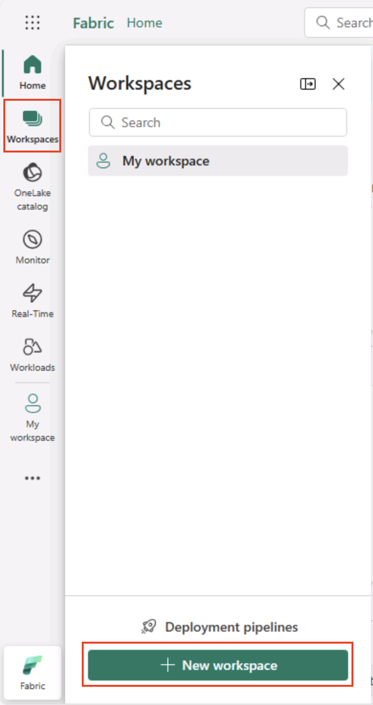
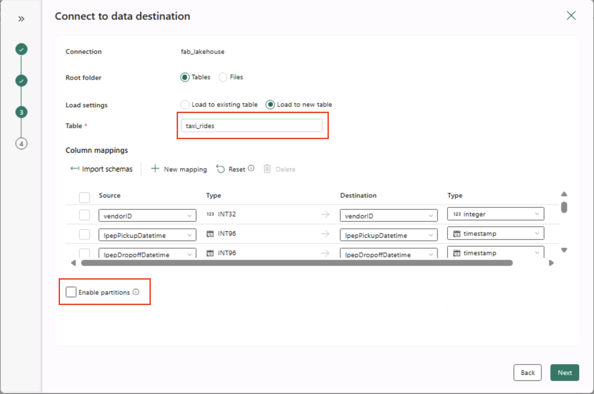
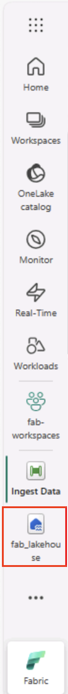

---
lab:
  title: Microsoft Fabric에서 데이터 분석 살펴보기
  module: Explore fundamentals of large-scale data analytics
---

# Microsoft Fabric에서 데이터 분석 살펴보기

이 연습에서는 Microsoft Fabric 레이크하우스에서 데이터 수집 및 분석을 살펴봅니다.

이 랩을 완료하면 다음과 같은 내용을 수행하게 됩니다.

- **Microsoft Fabric 레이크하우스 개념 이해**: Fabric에서 데이터 자산을 구성하고 관리하는 데 핵심적인 작업 영역 및 레이크하우스를 만드는 방법을 알아봅니다.
- **파이프라인을 사용하여 데이터 수집**: 단계별 파이프라인을 사용하여 외부 데이터를 레이크하우스로 가져와 수동 코딩 없이 쿼리할 수 있도록 합니다.
- **SQL을 사용하여 데이터 탐색 및 쿼리**: 친숙한 SQL 쿼리를 사용하여 수집된 데이터를 분석함으로써 Fabric 내에서 직접 인사이트를 얻습니다.
- **리소스 관리**: 불필요한 비용을 방지하기 위해 리소스를 정리하는 모범 사례를 알아봅니다.

## NYC Taxi 데이터 세트에 대한 배경:

"NYC Taxi - Green" 데이터 세트에는 승차 및 하차 시간, 위치, 운행 거리, 요금 및 승객 수를 비롯한 뉴욕시의 택시 운행에 대한 자세한 기록이 포함되어 있습니다. 이 데이터 세트는 도시 이동성, 수요 예측 및 변칙 검색을 탐색하기 위한 데이터 분석 및 기계 학습에 널리 사용됩니다. 이 랩에서는 이 실제 데이터 세트를 사용하여 Microsoft Fabric의 데이터 수집 및 분석을 연습합니다.

이 랩을 완료하는 데 약 **25**분이 걸립니다.

> **참고**: 이 연습을 완료하려면 Microsoft Fabric 라이선스가 필요합니다. 무료 [Fabric](https://learn.microsoft.com/fabric/get-started/fabric-trial) 평가판 라이선스를 사용하도록 설정하는 방법에 대한 자세한 내용은 Fabric 시작을 참조하세요. 이 작업을 수행하려면 Microsoft *학교* 또는 *회사* 계정이 필요합니다. 없는 경우 [Microsoft Office 365 E3 이상의 평가판에 등록](https://www.microsoft.com/microsoft-365/business/compare-more-office-365-for-business-plans)할 수 있습니다.

*Microsoft Fabric 기능을 처음 사용할 때 팁이 포함된 프롬프트가 나타날 수 있습니다. 이를 해제합니다.*

## 작업 영역 만들기

패브릭에서 데이터를 사용하기 전에 패브릭 평가판을 사용하도록 설정된 작업 영역을 만듭니다.

> _**팁**: 작업 영역은 모든 자산(레이크하우스, 파이프라인, Notebook, 보고서)에 대한 컨테이너입니다. Fabric 용량을 사용하도록 설정하면 이러한 항목을 실행할 수 있습니다._

1. 브라우저에서 [Microsoft Fabric 홈페이지](https://app.fabric.microsoft.com/home?experience=fabric)(`https://app.fabric.microsoft.com/home?experience=fabric`)로 이동하고 Fabric 자격 증명을 사용해 로그인합니다.

1. 왼쪽 메뉴 모음에서 **작업 영역**을 선택합니다(아이콘은 와 유사함).

    

1. 선택한 이름으로 새 작업 영역을 만들고 패브릭 용량(*평가판*, *프리미엄* 또는 *패브릭*)이 포함된 **고급** 섹션에서 라이선스 모드를 선택합니다.

    > _**팁** Fabric을 포함하는 용량을 선택하면 작업 영역에 데이터 엔지니어링 작업에 필요한 엔진이 제공됩니다. 전용 작업 영역을 사용하면 랩 리소스를 격리하고 쉽게 정리할 수 있습니다._

1. 새 작업 영역이 열리면 비어 있어야 합니다.

    

## 레이크하우스 만들기

이제 작업 영역이 있으므로 데이터 파일을 위한 데이터 레이크하우스를 만들 차례입니다.

> _**팁**: 레이크하우스는 OneLake에 파일과 테이블을 함께 제공합니다. 원시 파일을 저장하고 SQL을 사용하여 쿼리할 수 있는 관리형 Delta 테이블을 만들 수도 있습니다._

1. 왼쪽 메뉴 모음에서 **만들기**를 선택합니다. *새* 페이지의 *데이터 엔지니어링* 섹션에서 **레이크하우스**를 선택합니다. 원하는 고유한 이름.

    >**참고**: **만들기** 옵션이 사이드바에 고정되지 않은 경우 먼저 줄임표(**...**) 옵션을 선택해야 합니다.

    

    1분 정도 지나면 새 레이크하우스가 만들어집니다.

    

1. 새 레이크하우스를 보고 왼쪽의 **레이크하우스 탐색기** 창을 통해 레이크하우스의 테이블과 파일을 찾아볼 수 있습니다.
   
    - **Tables** 폴더에는 SQL 의미 체계를 사용하여 쿼리할 수 있는 테이블이 포함되어 있습니다. Microsoft Fabric 레이크하우스의 테이블은 Apache Spark에서 일반적으로 사용되는 오픈 소스 *Delta Lake* 파일 형식을 기반으로 합니다.
    - **Files** 폴더에는 관리되는 델타 테이블과 연결되지 않은 레이크하우스의 OneLake 스토리지에 데이터 파일이 포함되어 있습니다. 이 폴더에 *바로 가기*를 만들어 외부에 저장된 데이터를 참조할 수도 있습니다.

    현재 레이크하우스에는 테이블이나 파일이 없습니다.

    > _**팁**: 원시 또는 스테이징된 데이터에는 파일을 사용하고, 큐레이팅된 쿼리 준비 데이터 세트에는 테이블을 사용합니다. 테이블은 신뢰할 수 있는 업데이트 및 효율적인 쿼리를 지원하도록 Delta Lake에서 지원됩니다._

## 데이터 수집

데이터를 수집하는 간단한 방법은 파이프라인에서 **데이터 복사** 작업을 사용하여 원본에서 데이터를 추출하고 레이크하우스의 파일에 복사하는 것입니다.

> _**팁**: 파이프라인은 레이크하우스로 데이터를 가져오는 반복 가능한 단계별 방법을 제공합니다. 처음부터 새로 코딩하는 것보다 쉬우며 필요한 경우 나중에 진행되도록 예약할 수 있습니다._

1. 레이크하우스의 **홈** 페이지에 있는 **데이터 가져오기** 메뉴에서 **새 데이터 파이프라인**을 선택하고 **데이터 수집**이라는 이름의 새 데이터 파이프라인을 생성합니다.

    

1. **데이터 복사** 마법사의 **데이터 원본 선택** 페이지에서 **샘플 데이터**를 선택한 다음 **NYC 택시 - 그린** 샘플 데이터 집합을 선택합니다.

    

    

1. **데이터 원본에 연결** 페이지의 데이터 원본에서 테이블을 확인합니다. 뉴욕시에서 택시 여행의 세부 사항을 포함하는 하나의 테이블이 있어야합니다. 그런 다음, **다음**을 선택하여 **데이터 대상에 연결** 페이지로 진행합니다.

1. **데이터 대상에 연결** 페이지에서 다음 데이터 대상 옵션을 설정한 후 **다음**을 선택합니다.
    - **루트 폴더**: 테이블
    - **로드 설정**: 새 테이블로 로드
    - **대상 테이블 이름**: taxi_rides *(열 매핑 미리 보기가 표시될 때까지 기다려야 변경할 수 있음)*
    - **열 매핑**: *기본 매핑을 그대로 둡니다.*
    - **파티션 사용**: *선택 취소됨*

    

    > _**이러한 선택 옵션을 사용하는 이유**_
    > 
    > _테이블을 **.루트** 권한으로 시작하여 데이터가 바로 쿼리할 수 있는 관리형 Delta 테이블로 바로 이동되도록 합니다. 이 랩은 독립형으로 유지되어 기존 항목을 덮어쓰지 않도록 **새 테이블**에 로드합니다. 샘플 데이터가 이미 예상된 구조와 일치하여 사용자 지정 매핑이 필요하지 않으므로 **기본 열 매핑**을 유지하겠습니다. 단순하게 유지하기 위해 이 작은 데이터 세트의 경우 **분할**이 해제됩니다. 분할은 대규모 데이터에 유용하지만 여기서는 필요하지 않습니다._

1. **검토 + 저장** 페이지에서 **데이터 전송 즉시 시작** 옵션이 선택되어 있는지 확인하고 **저장 + 실행**을 선택합니다.

    > _**팁**: 즉시 시작하면 작동하는 파이프라인을 감시하면서 추가 단계 없이 데이터가 도착하는지 확인할 수 있습니다._

    다음과 같이 **데이터 복사** 작업이 포함된 새 파이프라인이 만들어집니다.

    

    파이프라인 실행이 시작되면 파이프라인 디자이너 아래의 **출력** 창에서 해당 상태를 모니터링할 수 있습니다. **&#8635;**(*새로 고침*) 아이콘을 사용하여 상태를 새로고침하고 성공할 때까지 기다립니다(10분 이상 소요될 수 있음). 이 특정 데이터 세트에는 약 2.5Gb의 데이터를 저장하는 7,500만 개 이상의 행이 포함되어 있습니다. 

1. 왼쪽의 허브 메뉴 모음에서 레이크하우스를 선택합니다.

    

1. **홈** 페이지에서, **레이크하우스 탐색기** 창에 있는 **테이블** 노드의 **…** 메뉴에서 **새로 고침**을 선택한 다음 **테이블**을 확장하여 **taxi_rides** 테이블이 생성되었는지 확인합니다.

    

    > **참고**: 새 테이블이 *식별되지 않은* 테이블로 나열된 경우 **새로 고침** 메뉴 옵션을 사용하여 보기를 새로 고칩니다.

    > _**팁**: 탐색기 보기가 캐시됩니다. 새로 고치면 새 테이블이 올바르게 표시되도록 최신 테이블 메타데이터를 가져옵니다._

1. **taxi_rides** 테이블을 선택하여 내용을 봅니다.

    

## 레이크하우스의 데이터 쿼리

이제 레이크하우스의 테이블에 데이터를 수집했으므로 SQL을 사용하여 쿼리할 수 있습니다.

> _**팁**: 레이크하우스 테이블에서 SQL을 사용할 수 있습니다. 다른 시스템으로 이동하지 않고 데이터를 즉시 분석할 수 있습니다._

1. 레이크하우스 페이지 오른쪽 상단에서 **레이크하우스** 보기에서 레이크하우스에 대한** SQL 분석 엔드포인트**로 전환합니다.

    

    > _**팁**: SQL 분석 엔드포인트는 레이크하우스 테이블을 통해 SQL 쿼리를 실행하는 데 최적화되어 있으며 친숙한 쿼리 도구와 통합됩니다._

1. 도구 모음에서 **새 SQL 쿼리**를 선택합니다. 다음 SQL 쿼리를 쿼리 편집기에 입력합니다.

    ```sql
    SELECT  DATENAME(dw,lpepPickupDatetime) AS Day,
            AVG(tripDistance) As AvgDistance
    FROM taxi_rides 
    GROUP BY DATENAME(dw,lpepPickupDatetime)
    ```

1. **&#9655; 실행** 버튼을 선택하여 쿼리를 실행하고 요일별 평균 여행 거리가 포함된 결과를 검토합니다.

    > _**팁**: 이 쿼리는 요일 이름별로 운행을 그룹화하고 평균 거리를 계산하며, 작성할 수 있는 집계의 간단한 예를 보여 줍니다._

    

## 리소스 정리

Microsoft Fabric 탐색을 완료한 경우 이 연습에 대해 만든 작업 영역을 삭제할 수 있습니다.

> _**팁**: 작업 영역을 삭제하면 랩에서 만든 모든 항목이 제거되므로 요금이 지속적으로 발생하지 않도록 할 수 있습니다._

1. 왼쪽 막대에서 작업 영역의 아이콘을 선택하여 포함된 모든 항목을 봅니다.

1. 메뉴에서 **작업 영역 설정**을 선택합니다.

1. **일반** 섹션에서 **이 작업 영역 제거**를 선택합니다.
