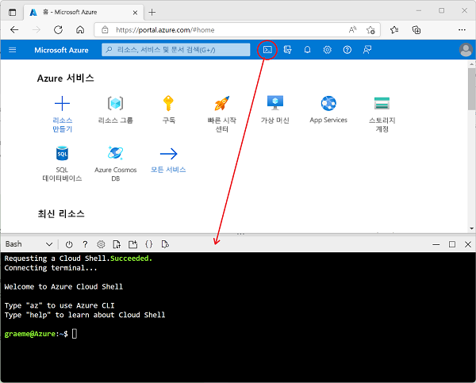

---
lab:
  title: Azure Stream Analytics 살펴보기
  module: Explore data analytics in Azure
ms.openlocfilehash: 925607333098d0774839d705d4e055a78e32de27
ms.sourcegitcommit: e73a39e323ef061919b58561ff1afdca876ad2b5
ms.translationtype: HT
ms.contentlocale: ko-KR
ms.lasthandoff: 04/07/2022
ms.locfileid: "141493694"
---
## Azure Stream Analytics 살펴보기

이 연습에서는 Azure 구독에서 Azure Stream Analytics 작업을 프로비저닝하고 이를 사용하여 실시간 데이터 스트림을 처리합니다.

> **참고**: 이 연습은 Microsoft Learn 모듈의 일부이며 샌드박스 Azure 구독을 사용하는 옵션을 포함합니다. 그러나 강사 주도 클래스의 일부로 이 연습을 완료하는 경우 샌드박스 대신 클래스의 일부로 제공된 Azure 구독을 사용해야 합니다.

Microsoft Learn에서 연습을 시작하기 전에 Azure 구독에 대한 클라우드 셸 환경을 준비해야 합니다.

1. Azure 구독 자격 증명을 사용하여 [Azure Portal](https://portal.azure.com)(`https://portal.azure.com`)에서 Azure 구독에 로그인합니다.
2. 페이지 위쪽의 검색 창 오른쪽에 있는 **[\>_]** 단추를 사용하여 Azure Portal에서 새 Cloud Shell을 만들고 **_Bash_** 환경을 선택하고 메시지가 표시되면 스토리지를 만듭니다. Cloud Shell은 다음과 같이 Azure Portal 아래쪽 창에 명령줄 인터페이스를 제공합니다.

    

3. 창 맨 위에 있는 구분 기호 막대를 끌거나 창 오른쪽 위에 있는 **&#8212;** , **&#9723;** 및 **X** 아이콘을 사용하여 Cloud Shell 크기를 조정하여 창을 최소화, 최대화하고 닫을 수 있습니다. Azure Cloud Shell 사용에 관한 자세한 내용은 [Azure Cloud Shell 설명서](https://docs.microsoft.com/azure/cloud-shell/overview)를 참조하세요.

4. 이제 Microsoft Learn에서 연습을 완료할 준비가 되었습니다. Learn 모듈(샌드박스 구독을 사용하여 자가 진행 학습자에게 제공됨)의 (비어 있는) 모듈 대신 Azure Portal에서 Cloud Shell을 사용해야 합니다.

    아래 링크를 사용하여 Microsoft Learn에서 연습을 엽니다.

    **[Microsoft Learn으로 이동](https://docs.microsoft.com/learn/modules/explore-fundamentals-stream-processing/5-exercise-stream-analytics#create-azure-resources)**

> **추가 학습**: 나중에 시간이 있으면 이 Microsoft Learn 모듈로 돌아가서 Spark Streaming 및 Azure Synapse Data Explorer 탐색 등 포함된 다른 연습을 시도하는 것이 좋습니다.
