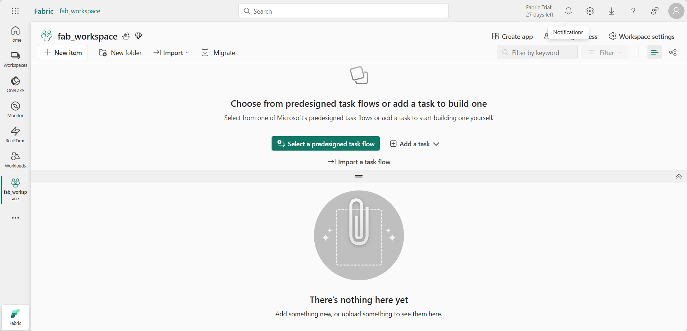
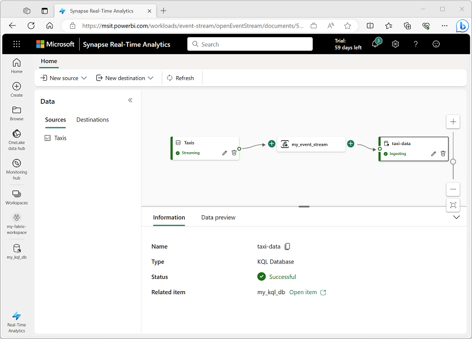
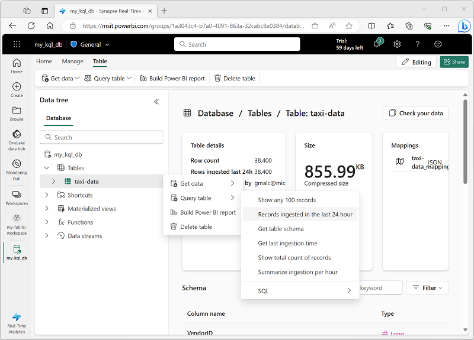

---
lab:
  title: Microsoft Fabric에서 실시간 분석 살펴보기
  module: Explore fundamentals of large-scale data analytics
---

# Microsoft Fabric에서 실시간 분석 살펴보기

이 연습에서는 Microsoft Fabric의 실시간 분석을 살펴봅니다.

이 랩을 완료하는 데 약 **25**분이 걸립니다.

> **참고**: 이 연습을 완료하려면 Microsoft Fabric 라이선스가 필요합니다. 무료 [패브릭](https://learn.microsoft.com/fabric/get-started/fabric-trial) 평가판 라이선스를 사용하도록 설정하는 방법에 대한 자세한 내용은 Fabric 시작을 참조하세요. 이렇게 하려면 Microsoft *학교* 또는 *회사* 계정이 필요합니다. E3 이상이 없는 경우 [Microsoft Office 365 평가판에 등록할](https://www.microsoft.com/microsoft-365/business/compare-more-office-365-for-business-plans) 수 있습니다.

## 작업 영역 만들기

패브릭에서 데이터로 작업하기 전에 패브릭 평가판을 사용하도록 설정된 작업 영역을 만듭니다.

1. 에서 `https://app.fabric.microsoft.com`[Microsoft Fabric](https://app.fabric.microsoft.com)에 로그인합니다.
2. 왼쪽 메뉴 모음에서 **작업 영역을** 선택합니다(아이콘은 &#128455;과 유사함).
3. 선택한 이름으로 새 작업 영역을 만들고 패브릭 용량(*평가판*, *프리미엄* 또는 *패브릭*)이 포함된 **고급** 섹션에서 라이선스 모드를 선택합니다.
4. 새 작업 영역이 열리면 비어 있어야 합니다.

    

## KQL 데이터베이스 만들기

이제 작업 영역이 있으므로 KQL 데이터베이스를 만들어 실시간 데이터를 저장할 수 있습니다.

1. 포털의 왼쪽 아래에서 **실시간 분석** 환경으로 전환합니다.

    

    실시간 분석 홈페이지에는 실시간 데이터 분석용으로 일반적으로 사용되는 자산을 만드는 타일이 포함되어 있습니다.

2. 실시간 분석 홈페이지에서 원하는 이름으로 새 **KQL 데이터베이스** 를 만듭니다.

    1분 정도 지나면 새 KQL 데이터베이스가 만들어집니다.

    

    현재 데이터베이스에는 테이블이 없습니다.

## Eventstream 만들기

Eventstreams는 스트리밍 원본에서 실시간 데이터를 수집하는 확장 가능하고 유연한 방법을 제공합니다.

1. 왼쪽의 메뉴 모음에서 실시간 분석 환경을 위한 **홈** 페이지를 선택합니다.
1. 홈페이지에서 타일을 선택하여 선택한 이름으로 새 **Eventstream** 을 만듭니다.

    잠시 후 eventstream에 대한 비주얼 디자이너가 표시됩니다.

    

    비주얼 디자이너 캔버스는 이벤트 스트림에 연결하는 원본을 보여 줍니다. 이 원본은 대상에 연결됩니다.

1. 디자이너 캔버스의 원본에 대한 **새 원본** 목록에서 **샘플 데이터를** 선택합니다. 그런 다음 **샘플 데이터** 창에서 이름 **taxis를** 지정하고 **노란색 택시** 샘플 데이터(택시 여정에서 수집된 데이터를 나타낸)를 선택합니다. 그런 다음, **추가**를 선택합니다.
1. 디자이너 캔버스 아래에서 **데이터 미리 보기** 탭을 선택하여 원본에서 스트리밍되는 데이터를 미리 봅니다.

    

1. 디자이너 캔버스의 대상에 대한 **새 대상** 목록에서 **KQL 데이터베이스**를 선택합니다. 그런 다음 **KQL 데이터베이스** 창에서 대상 이름 **taxi-data** 를 지정하고 작업 영역 및 KQL 데이터베이스를 선택합니다. 그런 다음 **, 만들기 및 구성을** 선택합니다.
1. **데이터 수집** 마법사의 **대상** 페이지에서 **새 테이블을 선택하고 테이블** 이름 **taxi-data**를 입력합니다. 그런 다음 **, 다음: 원본**을 선택합니다.
1. **원본** 페이지에서 기본 데이터 연결 이름을 검토한 다음 **, 다음: 스키마를** 선택합니다.
1. **스키마** 페이지에서 **데이터 형식**을 TXT에서 **JSON**으로 변경하고 미리 보기를 확인하여 이 형식으로 인해 여러 데이터 열이 생성되는지 확인합니다. 그런 다음 **, 다음: 요약을** 선택합니다.
1. **요약** 페이지에서 연속 수집이 설정될 때까지 기다린 다음, **닫기를** 선택합니다.
1. 완료된 eventstream이 다음과 같은지 확인합니다.

    

## KQL 데이터베이스에서 실시간 데이터 쿼리

Eventstream은 KQL 데이터베이스의 테이블을 지속적으로 채워 실시간 데이터를 쿼리할 수 있도록 합니다.

1. 왼쪽의 메뉴 허브에서 KQL 데이터베이스를 선택하거나 작업 영역을 선택하고 KQL 데이터베이스를 찾습니다.
1. 이벤트 스트림에서 만든 **taxi-data** 테이블의 **...** 메뉴에서 **지난 24시간 동안 수집된 레코드 > 쿼리 테이블을** 선택합니다.

    

1. 다음과 같이 KQL 쿼리여야 하는 쿼리의 결과를 봅니다.

    ```kql
    ['taxi-data']
    | where ingestion_time() between (now(-1d) .. now())
    ```

    결과에는 지난 24시간 동안 스트리밍 원본에서 수집된 모든 택시 레코드가 표시됩니다.

1. 쿼리 편집기의 위쪽 절반에 있는 모든 KQL 쿼리 코드를 다음 코드로 바꿉 있습니다.

    ```kql
    // This query returns the number of taxi pickups per hour
    ['taxi-data']
    | summarize PickupCount = count() by bin(tpep_pickup_datetime, 1h)
    ```

1. **&#9655; 실행** 단추를 사용하여 쿼리를 실행하고 각 시간에 대한 택시 픽업 수를 표시하는 결과를 검토합니다.

## 리소스 정리

Microsoft Fabric에서 실시간 분석 탐색을 완료한 경우 이 연습을 위해 만든 작업 영역을 삭제할 수 있습니다.

1. 왼쪽 막대에서 작업 영역의 아이콘을 선택하여 포함된 모든 항목을 봅니다.
2. 도구 모음의 **...** 메뉴에서 **작업 영역 설정을** 선택합니다.
3. **기타** 섹션에서 **이 작업 영역 제거**를 선택합니다.
