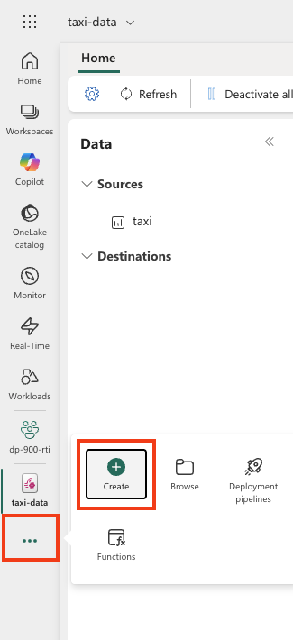

---
lab:
  title: Microsoft Fabric에서 실시간 분석 살펴보기
  module: Explore real-time analytics in Microsoft Fabric
---

# Microsoft Fabric에서 실시간 분석 살펴보기

Microsoft Fabric은 실시간 인텔리전스를 제공하여 실시간 데이터 스트림에 대한 분석 솔루션을 만들 수 있습니다. 이 실습에서는 Microsoft Fabric의 실시간 인텔리전스 기능을 사용하여 택시 회사의 실시간 데이터 스트림을 수집, 분석 및 시각화합니다.

이 랩을 완료하는 데 약 **30**분이 소요됩니다.

> **참고**: 이 연습을 완료하려면 [Microsoft Fabric 테넌트](https://learn.microsoft.com/fabric/get-started/fabric-trial)가 필요합니다.

## 작업 영역 만들기

Fabric에서 데이터로 작업하기 전에, Fabric 용량을 사용하도록 설정된 작업 영역을 만들어야 합니다.

> _**팁**: 작업 영역은 사용자가 만드는 모든 항목(eventstreams, eventhouses, 대시보드)에 대한 컨테이너입니다. 패브릭 용량을 사용하면 이러한 품목을 실행할 수 있습니다._

1. 브라우저에서 [Microsoft Fabric 홈페이지](https://app.fabric.microsoft.com/home?experience=fabric)(`https://app.fabric.microsoft.com/home?experience=fabric`)로 이동하고 Fabric 자격 증명을 사용해 로그인합니다.

1. 왼쪽 메뉴 모음에서 **작업 영역**을 선택합니다(아이콘은 와 유사함).

1. Fabric 용량이 포함된 라이선스 모드(*평가판*, *프리미엄* 또는 *Fabric*)를 선택하여 원하는 이름으로 새 작업 영역을 만듭니다.

    > _**팁**: 패브릭을 포함하는 용량을 사용하려면 작업 영역에 실시간 수집 및 분석에 필요한 엔진이 있어야 합니다. 별도의 작업 영역을 통해 랩 리소스를 격리하고 쉽게 정리할 수 있습니다._

1. 새 작업 영역이 열리면 비어 있어야 합니다.

    

## Eventstream 만들기

이제 스트리밍 원본에서 실시간 데이터를 찾고 수집할 준비가 되었습니다. 이렇게 하려면 Fabric 실시간 허브에서 시작합니다.

> _**팁**: 실시간 허브는 스트리밍 원본을 중앙에서 관리하고 쉽게 연결할 수 있도록 해줍니다. Eventstream은 원본을 대상에 연결하고 그 사이에 변환을 추가할 수 있습니다._

> **팁**: 실시간 허브를 처음 사용하는 경우 몇 가지 *시작* 팁이 표시될 수 있습니다. 이 팁은 닫을 수 있습니다.

1. 왼쪽 메뉴 모음에서 **실시간** 허브를 선택합니다.

    실시간 허브는 스트리밍 데이터의 원본을 쉽게 찾고 관리할 수 있는 방법을 제공합니다.

    

1. 실시간 허브의 **연결 대상** 섹션에서 **데이터 원본**을 선택합니다.

1. **노란 택시** 샘플 데이터 원본을 찾아 **연결**을 선택합니다. 그런 다음 **연결** 마법사에서 소스 이름을 `taxi`(으)로 지정하고 기본 이벤트 스트림 이름을 편집하여 `taxi-data`(으)로 변경합니다. 이 데이터와 연결된 기본 스트림의 이름은 자동으로 *taxi-data-stream*으로 지정됩니다.

    > _**팁**: 노란색 택시 샘플은 안전한 공용 스트림이며 자격 증명이 필요하지 않으며 모든 학습자에게 일관되게 적용됩니다. 명확한 이름을 사용하면 나중에 원본, Eventstream 및 스트림을 더 쉽게 찾을 수 있습니다._

    

1. **다음**을 선택하고 원본 및 이벤트 스트림이 생성될 때까지 기다린 다음 **이벤트 스트림 열기**를 선택합니다. 이벤트 스트림은 디자인 캔버스에 **taxi** 원본과 **taxi-data-stream**을 표시합니다.

   

## 이벤트 하우스 만들기

Eventstream은 실시간 택시 데이터를 수집하지만 현재 이 데이터로 아무 작업도 하지 않습니다. 캡처한 데이터를 테이블에 저장할 수 있는 이벤트 하우스를 만들어 보겠습니다.

> _**팁**: Eventhouse는 지속적인 스토리지와 KQL 데이터베이스를 제공하므로 새로운 이벤트가 도착하더라도 스트림을 유지하여 나중에 쿼리할 수 있습니다. KQL(Kusto 쿼리 언어)은 대규모 데이터 세트를 빠르게 탐색, 필터링 및 분석하는 데 사용되는 읽기 전용 SQL 유사 언어입니다._

1. 왼쪽 메뉴 모음에서 **만들기**를 선택합니다. *새로 만들기* 페이지의 *실시간 인텔리전스* 섹션에서 **Eventhouse**를 선택합니다. 원하는 고유한 이름.

    >**참고**: **만들기** 옵션이 사이드바에 고정되지 않은 경우 먼저 줄임표(**...**) 옵션을 선택해야 합니다.

    

    빈 이벤트 하우스가 새로 표시될 때까지 표시되는 팁이나 프롬프트를 닫습니다.

    

1. 왼쪽 창에서 이벤트 하우스에는 이벤트 하우스와 이름이 같은 KQL 데이터베이스가 포함되어 있습니다. 이 데이터베이스에서 실시간 데이터에 대한 테이블을 만들거나 필요에 따라 추가 데이터베이스를 만들 수 있습니다.

1. 데이터베이스를 선택하고 연관된 *queryset*가 있는지 확인합니다. 이 파일에는 데이터베이스의 테이블 쿼리를 시작하는 데 사용할 수 있는 몇 가지 샘플 KQL 쿼리가 포함되어 있습니다.

    > _**팁**: KQL 데이터베이스는 테이블을 보유합니다. Queryset는 추가 설정 없이 쿼리를 작성하고 실행할 수 있는 편리한 장소입니다._

    그러나 현재 쿼리할 테이블은 없습니다. 이벤트 스트림에서 새 테이블로 데이터를 가져오면 이 문제를 해결해 보겠습니다.

1. KQL 데이터베이스의 기본 페이지에서 **데이터 가져오기**를 선택합니다.

    

1. 데이터 원본의 경우 **Eventstream** > **기존 이벤트 스트림**을 선택합니다.

1. **대상 테이블 선택 또는 만들기** 창에서 `taxi`(이)라는 새 테이블을 만듭니다. 그런 다음 **데이터 원본 구성** 창에서 작업 영역과 **taxi-data** 이벤트 스트림을 선택하고 연결 이름을 `taxi-table`(으)로 지정합니다.

   

1. **다음** 단추를 사용하여 데이터를 검사한 다음 구성을 완료하는 단계를 **완료합니다**. 그런 다음 구성 창을 닫아 택시 테이블이 있는 이벤트 하우스를 확인합니다.

   

    스트림과 테이블 간의 연결이 만들어졌습니다. 이벤트 스트림에서 확인해 보겠습니다.

1. 왼쪽 메뉴 모음에서 **실시간** 허브를 선택한 다음 **내 데이터 스트림** 페이지를 확인합니다. **taxi-data-stream** 스트림의 **...** 메뉴에서 **이벤트 스트림 열기**를 선택합니다.

    이제 이벤트 스트림에 스트림의 대상이 표시됩니다.

   

    > _**팁**: 디자인 캔버스에서 대상을 선택하고 그 아래에 데이터 미리 보기가 표시되지 않으면 **새로 고침**을 선택합니다._

    > _**팁**: Eventstream에서 확인하면 이벤트가 대상으로 흐르는지 확인합니다. 미리보기는 캐시될 수 있습니다. 새로 고침하면 최신 샘플을 가져옵니다._

    이 연습에서는 실시간 데이터를 캡처하고 테이블에 로드하는 매우 간단한 이벤트 스트림을 만들었습니다. 실제 솔루션에서는 일반적으로 임시 창(예: 5분 동안 각 주식의 평균 가격을 캡처)을 통해 데이터를 집계하는 변환을 추가합니다.

    이제 캡처된 데이터를 쿼리하고 분석하는 방법을 살펴보겠습니다.

## 캡처된 데이터 쿼리

이벤트 스트림은 실시간 택시 요금 데이터를 캡처하여 KQL 데이터베이스의 테이블에 로드합니다. 이 테이블을 쿼리하여 캡처된 데이터를 볼 수 있습니다.

> _**팁**: KQL은 타임스탬프가 있는 대용량 데이터를 빠르게 탐색하도록 설계되었습니다. 쿼리를 사용하면 수집의 유효성을 검증하고 즉시 분석을 시작할 수 있습니다._

1. 왼쪽 메뉴 모음에서 이벤트 하우스 데이터베이스를 선택합니다.

1. 데이터베이스에 대한 *queryset*를 선택합니다.

1. 쿼리 창에서 다음과 같이 첫 번째 예제 쿼리를 수정합니다.

    ```kql
    taxi
    | take 100
    ```

    > _**Tip**: `take 100` 빠른 상태 검사입니다. 행이 도착하는지 확인하고 모든 항목을 검사하지 않고 작은 샘플을 검사합니다._

1. 쿼리 코드를 선택하고 실행하여 테이블에서 100개의 데이터 행을 확인합니다.

    

1. 결과를 검토한 다음 시간대별 택시 픽업 횟수를 표시하도록 쿼리를 수정합니다.

    ```kql
    taxi
    | summarize PickupCount = count() by bin(todatetime(tpep_pickup_datetime), 1h)
    ```

1. 수정된 쿼리를 강조 표시하고 실행하여 결과를 확인합니다.

    > _**팁**: `bin(..., 1h)` 이벤트를 매시간 버킷으로 그룹화하여 시간에 따른 추세를 쉽게 파악할 수 있습니다._

1. 실시간 스트림에서 테이블에 새 데이터가 추가되면 픽업 수가 변경되는 것을 확인하고 몇 초 기다렸다가 다시 실행합니다.

    > _**팁**: 스트림은 데이터를 계속 추가하므로 시간이 지남에 따라 결과가 변경됩니다. 다시 실행하면 새로운 이벤트가 도착함에 따라 집계가 어떻게 업데이트되는지 보여줍니다._

## 리소스 정리

이 연습에서는 이벤트 하우스를 만들고, 이벤트 스트림을 사용하여 실시간 데이터를 수집하고, KQL 데이터베이스 테이블에서 수집된 데이터를 쿼리하고, 실시간 데이터를 시각화하는 실시간 대시보드를 만들고, Activator를 사용하여 경고를 구성했습니다.

Fabric에서 실시간 인텔리전스 탐색을 완료한 경우 이 연습에 대해 만든 작업 영역을 삭제할 수 있습니다.

> _**팁**: 작업 영역을 삭제하면 랩에서 만든 모든 항목이 제거되므로 요금이 지속적으로 발생하지 않도록 할 수 있습니다._

1. 왼쪽 막대에서 작업 영역의 아이콘을 선택합니다.

1. 도구 모음에서 **작업 영역 설정**을 선택합니다.

1. **일반** 섹션에서 **이 작업 영역 제거**를 선택합니다.
