---
lab:
  title: Power BI를 사용하여 데이터 시각화의 기본 사항 살펴보기
  module: Explore fundamentals of data visualization
---

# Power BI를 사용하여 데이터 시각화의 기본 사항 살펴보기

이 랩을 완료하면 Power BI Desktop의 여러 원본에서 데이터를 가져오고 모델링하고, 심층 분석을 위한 관계 및 계층 구조를 만들고, 시각화를 향상시키기 위해 데이터의 형식을 지정하고 분류하는 방법을 알아봅니다. 테이블, 차트 및 맵을 사용하여 대화형 보고서를 작성하고 드릴다운 및 교차 강조 표시 기능을 통해 데이터 인사이트를 탐색합니다. 이러한 기술을 활용하면 원시 데이터를 매력적인 시각적 스토리와 실행 가능한 비즈니스 인텔리전스로 변환할 수 있습니다.

이 랩을 완료하는 데 약 **20**분이 걸립니다.

## Power BI Desktop 설치

Microsoft Power BI Desktop이 아직 Windows 컴퓨터에 설치되어 있지 않은 경우 무료로 다운로드하여 설치할 수 있습니다.

> _**팁**: Power BI Desktop은 모델을 공유하기 전에 로컬로 모델 및 보고서를 빌드하는 제작 도구입니다. 학습 및 프로토타입 생성을 위해 무료로 설치할 수 있습니다._

1. [https://aka.ms/power-bi-desktop](https://aka.ms/power-bi-desktop?azure-portal=true)에서 Power BI Desktop 설치 프로그램을 다운로드합니다.

1. 파일이 다운로드되면 파일을 열고 설치 마법사를 사용하여 컴퓨터에 Power BI Desktop을 설치합니다. 설치하는 데 몇 분 정도 걸릴 수 있습니다.

## 데이터 가져오기

1. Power BI Desktop을 실행합니다. 그 애플리케이션 인터페이스는 다음과 유사합니다.

    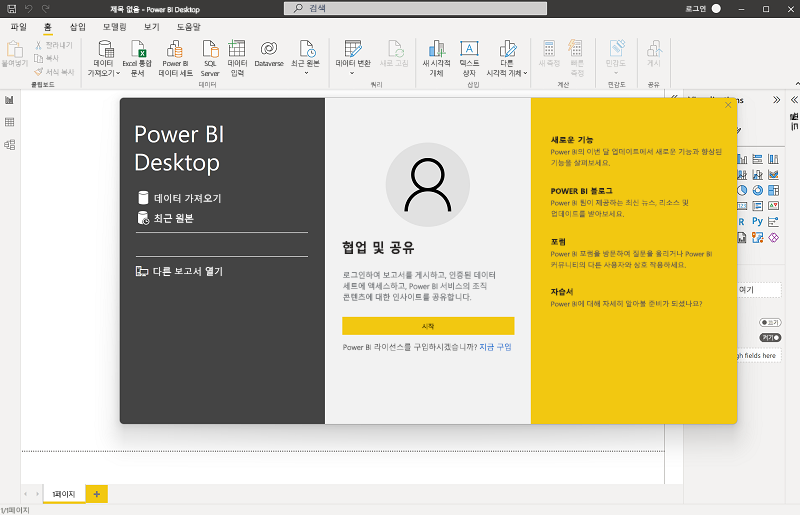

    이제 보고서용 데이터를 가져올 준비가 되었습니다.

1. Power BI Desktop 시작 화면에서 **다른 원본에서 데이터 가져오기**를 선택한 다음 데이터 원본 목록에서 **웹**을 선택하고 **연결**을 선택합니다.

    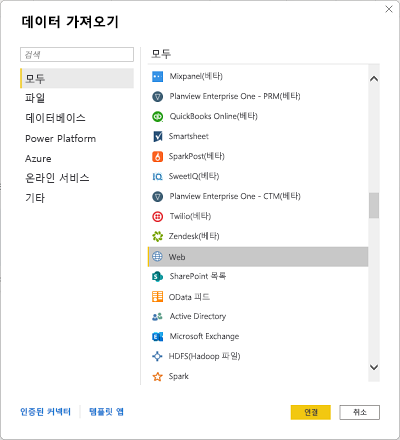

1. **웹에서** 대화 상자에서 다음 URL을 입력하고 **확인**을 선택합니다.

    ```
    https://github.com/MicrosoftLearning/DP-900T00A-Azure-Data-Fundamentals/raw/master/power-bi/customers.csv
    ```

    > _**팁**: 샘플 CSV 파일과 함께 웹 커넥터를 사용하면 모든 사용자가 동일한 클린 데이터(로컬 파일 또는 자격 증명이 필요 없음)에서 작동합니다._

1. 웹 콘텐츠 액세스 대화 상자에서 **연결**을 선택합니다.

1. URL에서 아래와 같이 고객 데이터가 포함된 데이터 세트가 열리는지 확인합니다. 그런 다음 **로드**를 선택하여 보고서용 데이터 모델로 데이터를 로드합니다.

    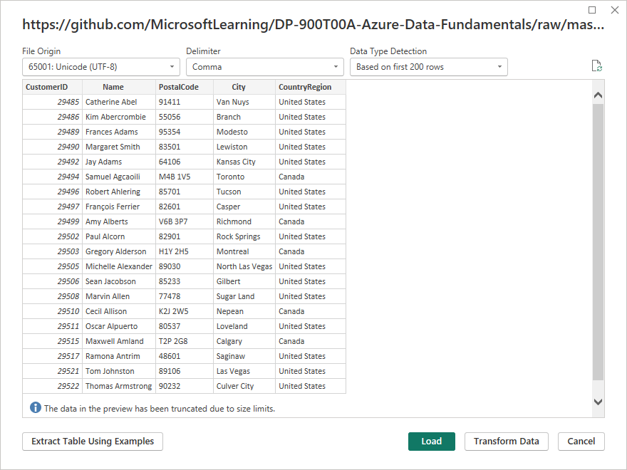

    > _**팁**: 이 랩에서 데이터를 직접 로드하는 것이 가장 빠릅니다. 필요한 경우 나중에 Power Query에서 언제든지 변환을 적용할 수 있습니다._

1. 주 Power BI Desktop 창의 **데이터 가져오기**를 선택한 다음, **웹**을 선택합니다.

    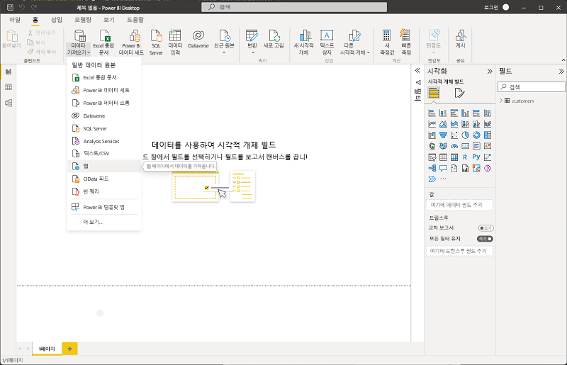

1. **웹에서** 대화 상자에서 다음 URL을 입력하고 **확인**을 선택합니다.

    ```
    https://github.com/MicrosoftLearning/DP-900T00A-Azure-Data-Fundamentals/raw/master/power-bi/products.csv
    ```

1. 대화 상자에서 **로드**를 선택하여 이 파일의 제품 데이터를 데이터 모델에 로드합니다.

1. 이전 세 단계를 반복하여 다음 URL에서 주문 데이터가 포함된 세 번째 데이터 세트를 가져옵니다.

    ```
    https://github.com/MicrosoftLearning/DP-900T00A-Azure-Data-Fundamentals/raw/master/power-bi/orders.csv
    ```

    > _**팁**: 고객, 제품 및 주문을 가져오면 작고 현실적인 모델이 만들어집니다. 여러 관련 테이블을 사용하면 엔터티를 분석할 수 있습니다(예: 제품 범주 및 도시별 수익)._

## 데이터 모델 탐색

가져온 데이터의 세 테이블이 데이터 모델에 로드되었으니 이제부터 이것을 탐색하고 상세히 검색합니다.

1. Power BI Desktop 왼쪽 가장자리에서 **모델** 탭을 선택한 다음, 모델의 테이블을 정렬하여 표시할 수 있습니다. **>>** 아이콘을 사용하여 오른쪽의 창을 숨길 수 있습니다.

    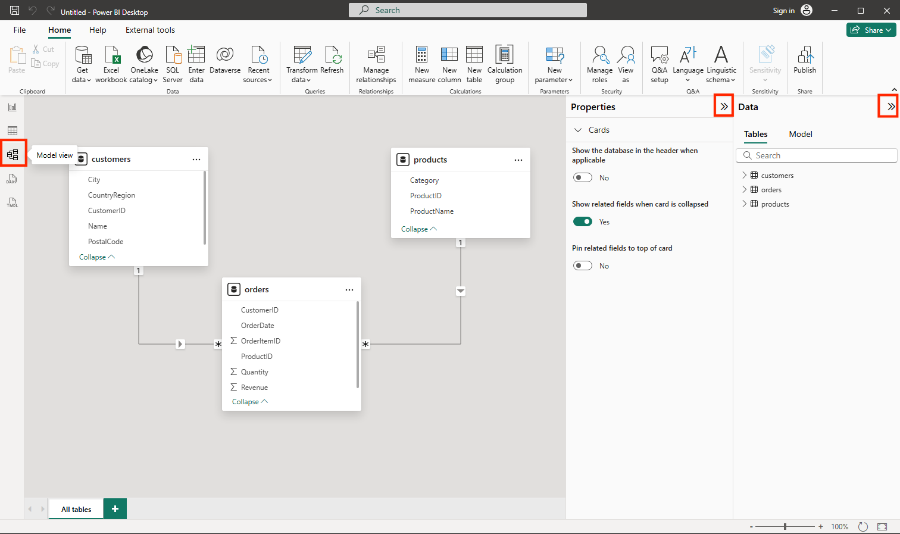

1. **주문** 테이블에서 **수익** 필드를 선택한 다음, **속성** 창에서 그 **형식** 속성을 **화**로 설정합니다.

    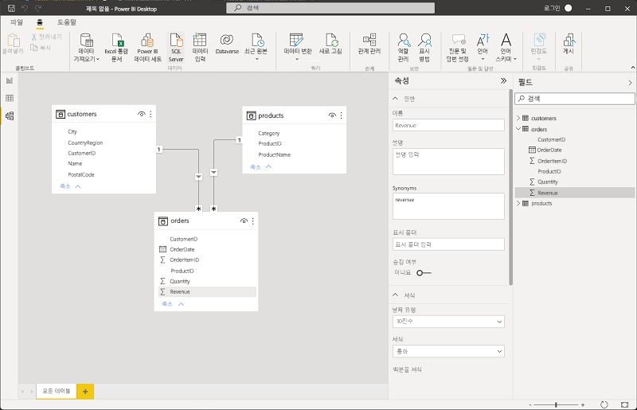

    이 단계에서는 수익 값이 보고서 시각화에 통화로 표시되도록 합니다.

    > _**팁**: 서식 측정값은 시각적 개체의 가독성을 향상시키고 비즈니스 사용자가 예상하는 방식에 따라 숫자를 정렬합니다._

1. 제품 테이블에서 **Category** 필드를 마우스 오른쪽 단추로 클릭하고(또는 **&vellip;** 메뉴를 열고) **계층 구조 만들기**를 선택합니다. 이 단계에서는 **범주 계층**이라는 계층 구조를 만듭니다. 이것을 표시하려면 **products** 테이블을 확장하거나 스크롤해야 할 수 있습니다. **필드** 창에도 표시할 수 있습니다.

    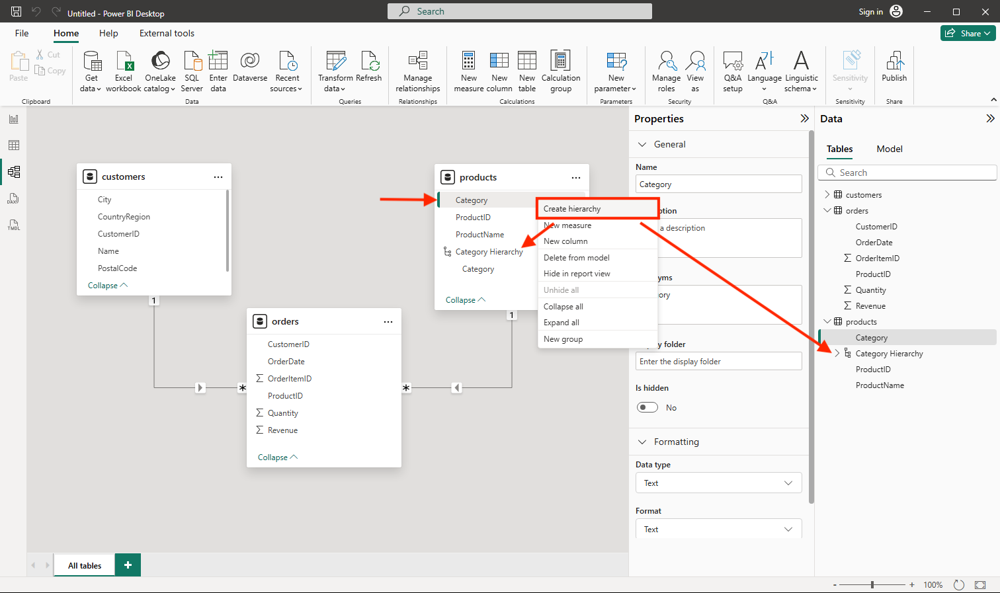

1. 제품 테이블에서 **ProductName** 필드를 마우스 오른쪽 단추로 클릭하고(또는 **&vellip;** 메뉴를 열고) **계층 구조에 추가** > **범주 계층**을 선택합니다. 그러면 이전에 만든 계층 구조에 **ProductName** 필드가 추가됩니다.

    

1. **필드** 창에서 **범주 계층**을 마우스 오른쪽 단추로 클릭하고(또는 해당 **...** 메뉴를 열고) **이름 바꾸기**를 선택합니다. 그런 다음, 계층 구조의 이름을 **Categorized Product**로 바꿉니다.

    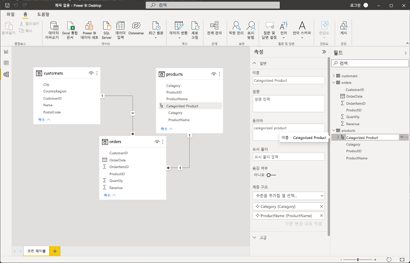

    > _**팁**: 범주→프로덕트 계층 구조를 사용하면 시각적 개체를 드릴다운할 수 있으므로 뷰어는 요약에서 세부 정보로 탐색할 수 있습니다._

1. 왼쪽 가장자리에서 **테이블 보기** 탭을 선택한 다음 **데이터** 창에서 **고객** 테이블을 선택합니다.

1. **시** 열 머리글을 선택한 다음, 해당 **데이터 범주** 속성을 **도시**로 설정합니다.

    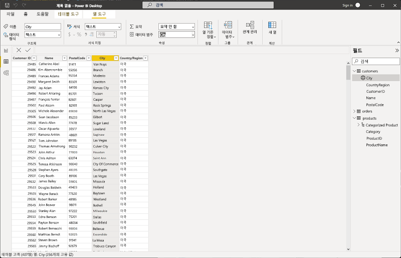

    이 단계에서는 이 열의 값이 도시 이름으로 해석되도록 하며 지도 시각화를 포함하려는 경우에 유용할 수 있습니다.

    > _**팁**: 데이터 범주는 Power BI 지역 코드 위치를 올바르게 지원하므로 맵 시각적 개체가 올바른 위치에 지점을 배치합니다._

## 보고서 만들기

이제 보고서를 만들 준비가 거의 완료되었습니다. 먼저 일부 설정을 확인하여 모든 시각화를 사용하도록 설정해야 합니다.

1. **파일** 메뉴에서 **옵션 및 설정**을 선택합니다. 그런 다음 **옵션**을 선택하고 **보안** 섹션에서 **지도 및 채워진 지도 시각 개체 사용**이 사용하도록 설정되어 있는지 확인하고 **확인**을 선택합니다.

    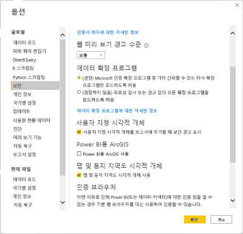

    이 설정을 사용하면 보고서에 지도 시각화를 포함할 수 있습니다.

    > _**팁**: 일부 환경에서는 맵 시각적 개체가 꺼져 있습니다. 이를 사용하도록 설정하면 시각화 창에 맵 시각적 개체가 표시됩니다._

1. 왼쪽 가장자리에서 **보고서 뷰** 탭을 선택하고 보고서 디자인 인터페이스를 확인합니다.

    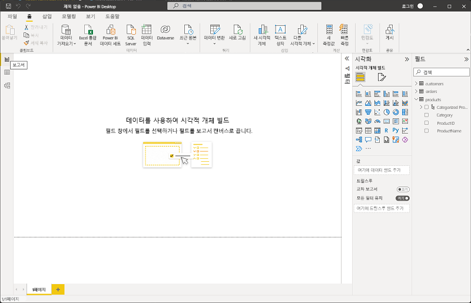

1. 리본의 보고서 디자인 화면 위에서 **텍스트 상자**를 선택하고 **판매 보고서**가 포함된 텍스트 상자를 보고서에 추가합니다. 글꼴 크기 32로 굵게 표시되도록 텍스트 서식을 지정합니다.

    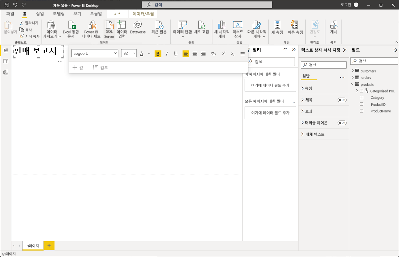

    > _**팁**: 명확한 제목은 사용자가 보고서의 목적을 한눈에 이해할 수 있도록 도와줍니다._

1. 보고서에서 빈 영역을 선택하여 텍스트 상자의 선택을 해제합니다. 그런 다음 **데이터** 창에서 **제품**을 확장하고 **범주화된 제품** 필드를 선택합니다. 이 단계에서는 보고서에 테이블을 추가합니다.

    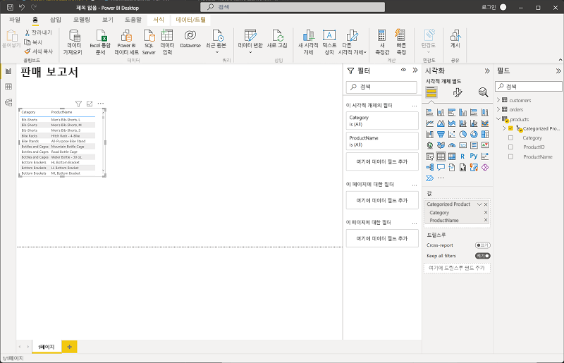

    > _**팁**: 이제 계층 필드를 사용하여 드릴다운을 원활하게 지원하는 시각적 개체로 전환할 수 있습니다._

1. 테이블이 선택된 상태에서 **데이터** 창의 **주문**을 확장하고 **수익**을 선택합니다. 테이블에 새 Revenue 열이 추가됩니다. 확인하려면 테이블 크기를 확장해야 할 수도 있습니다.

    수익은 모델에서 지정한 대로 통화 형식으로 지정됩니다. 그러나 소수 자릿수를 지정하지 않았으므로 값에 소수부 금액이 포함됩니다. 만들려는 시각화는 중요하지 않지만 **모델** 또는 **데이터** 탭으로 돌아가 소수 자릿수를 변경할 수 있습니다.

    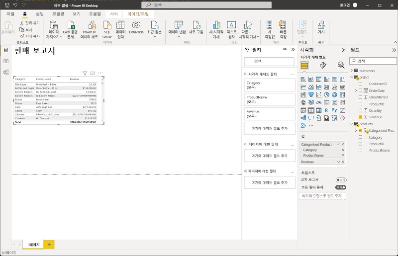

1. 테이블이 선택된 상태에서 **시각화** 창에서 **누적 세로 막대형 차트** 시각화를 선택합니다. 테이블이 범주별 수익을 보여주는 세로 막대형 차트로 바뀝니다.

    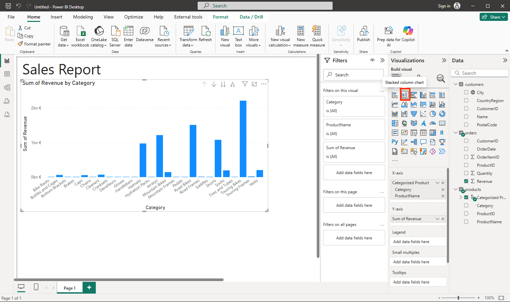

    > _**팁**: 세로 막대형 차트를 사용하면 범주를 나란히 쉽게 비교할 수 있습니다._

1. 선택한 세로 막대형 차트 위에서 **&#8595;** 아이콘을 선택하여 드릴다운을 켭니다. 그런 다음 차트에서 원하는 열을 선택하여 드릴다운하고 해당 범주의 개별 제품의 수익을 확인합니다. 이 기능은 범주와 제품의 계층 구조를 정의했기 때문에 가능합니다.

    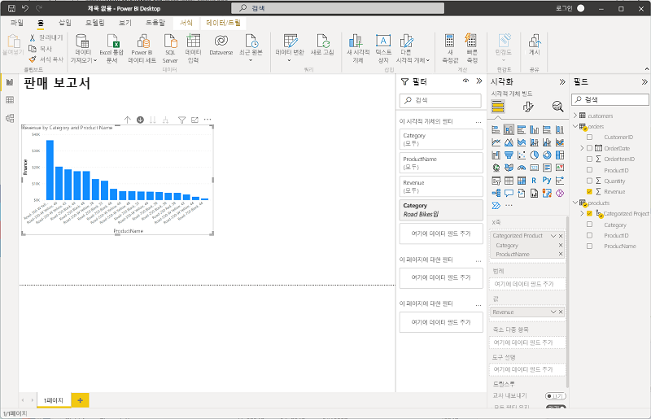

    > _**팁**: 드릴다운은 보기를 복잡하게 만들지 않고 요청 시 세부 정보를 표시하며 계층화된 인사이트에 적합합니다._

1. 범주 수준까지 다시 드릴업하려면 **&#x2191;** 아이콘을 사용합니다. 그런 다음, **(**&#8595;**)** 아이콘을 선택하여 드릴다운 기능을 해제합니다.

1. 보고서의 빈 영역을 선택한 다음, **데이터** 창에서 **주문** 테이블의 **수량** 필드와 **제품** 테이블의 **범주** 필드를 선택합니다. 이 단계를 수행하면 제품 범주별 판매 수량을 보여 주는 다른 세로 막대형 차트가 생성됩니다.

1. 새 세로 막대형 차트를 선택한 상태에서 **시각화** 창에서 **원형 차트**를 선택한 다음, 차트 크기를 조정하고 범주 세로 막대형 차트별로 수익 옆에 배치합니다.

    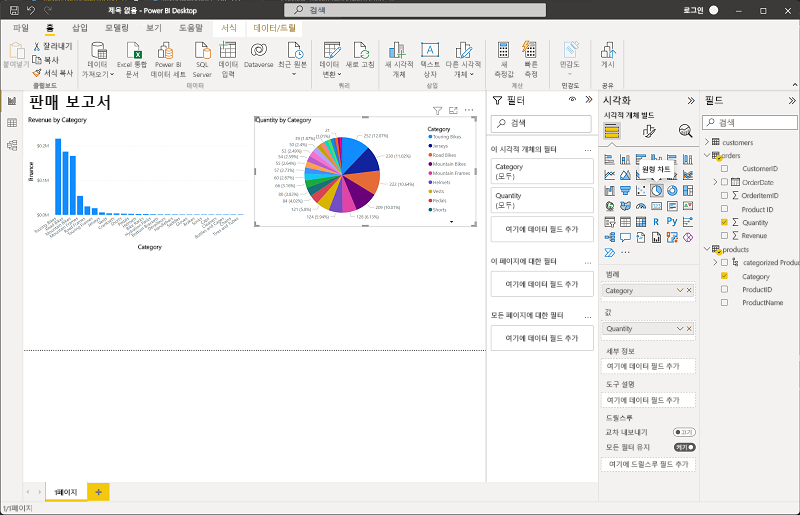

    > _**팁**: 범주별 수량을 원형으로 표시하면 비례 기여도가 강조 표시되어 수익 세로 막대형 차트가 보완됩니다._

1. 보고서의 빈 영역을 선택한 다음 **데이터** 창에서 **고객** 테이블에서 **도시** 필드를 선택한 다음, **주문** 테이블에서 **수익** 필드를 선택합니다. 그 결과 도시별 판매 수익을 보여 주는 지도가 생성됩니다. 필요에 따라 시각화를 다시 정렬하고 크기를 조정합니다.

    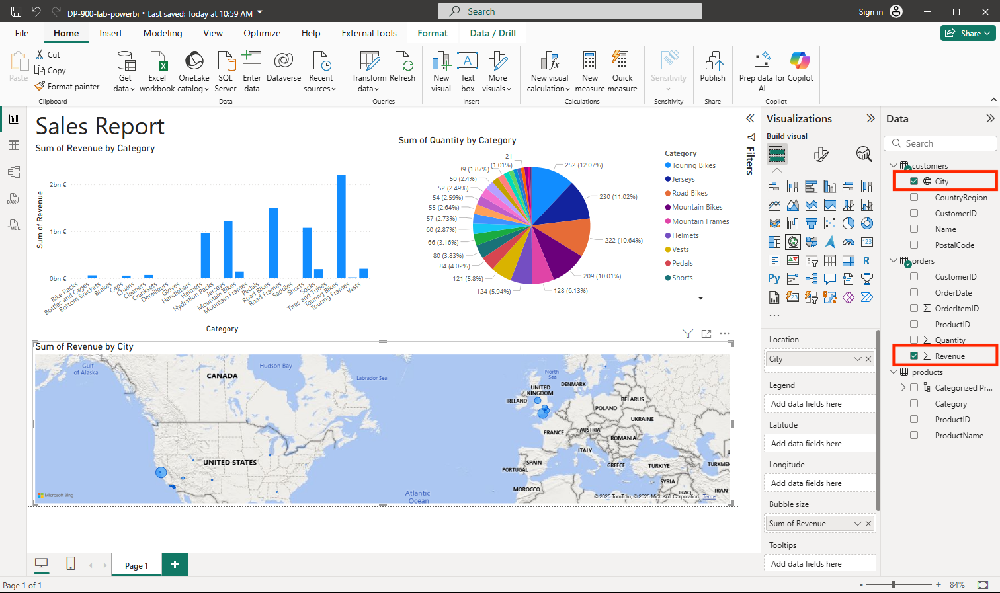

    > _**팁**: 도시별 매핑 수익은 지리적 렌즈를 추가합니다. 테이블이나 차트에서 명확하지 않은 패턴은 지도에 표시할 수 있습니다._

1. 지도에서 끌거나, 두 번 클릭하거나, 마우스 휠을 사용하거나, 터치 스크린을 잡아 끌어 상호작용할 수 있습니다. 그런 다음 특정 도시를 선택하고 보고서의 나머지 시각화가 수정되어 선택한 도시의 데이터가 강조표시되는지 확인합니다.

    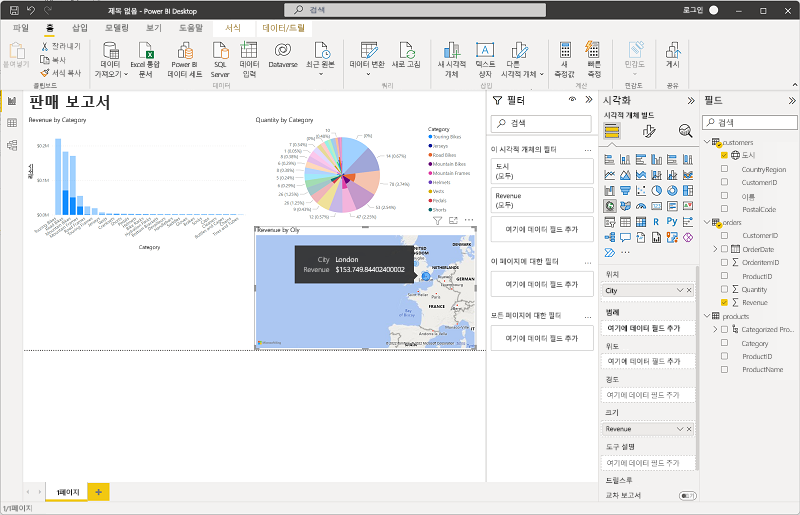

    > _**팁**: 교차 강조 표시를 사용하면 사용자가 하나의 시각적 개체와 상호 작용하고 페이지 전체에서 관련 변경 내용을 볼 수 있으며 정적 보고서를 대화형 환경으로 전환할 수 있습니다._

1. **파일** 메뉴에서 **저장**을 선택합니다. 그런 다음 적절한 .pbix 파일 이름으로 파일을 저장합니다. 한가한 시간에 파일을 열고 데이터 모델링 및 시각화를 추가로 탐색할 수 있습니다.

    > _**팁**: .pbix를 저장하면 모델, 쿼리 및 보고서가 함께 유지되므로 나중에 다시 열고 반복할 수 있습니다._

[Power BI 서비스](https://www.powerbi.com/?azure-portal=true) 구독이 있는 경우 계정에 로그인하고 보고서를 Power BI 작업 영역에 게시할 수 있습니다. 

> **팁**: Power BI 서비스 게시하면 보고서를 공유하고, 새로 고침을 예약하고, 작업 영역의 다른 사용자와 공동 작업할 수 있습니다.
