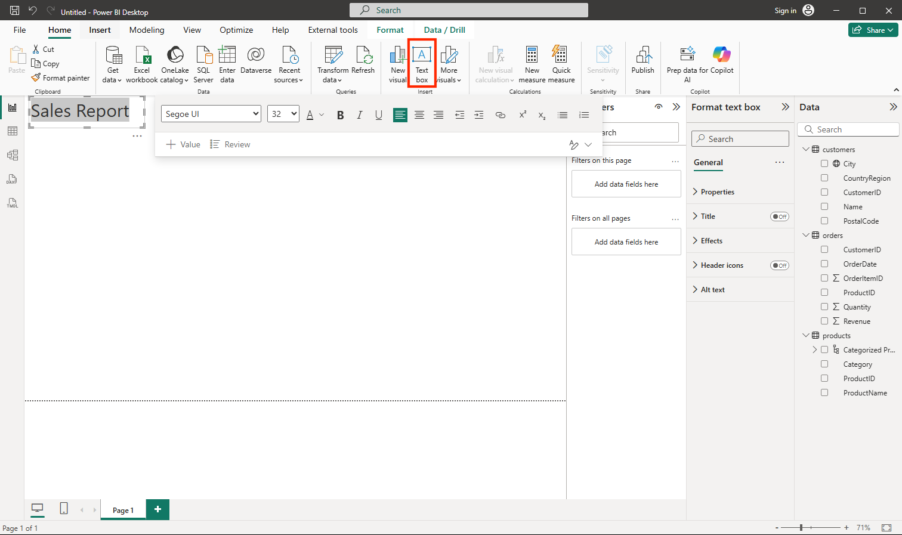

---
lab:
  title: Power BI를 사용하여 데이터 시각화의 기본 사항 살펴보기
  module: Explore fundamentals of data visualization
---

# <a name="explore-fundamentals-of-data-visualization-with-power-bi"></a>Power BI를 사용하여 데이터 시각화의 기본 사항 살펴보기

이 연습에서는 Microsoft Power BI Desktop을 사용하여 대화형 데이터 시각화를 포함하는 데이터 모델 및 보고서를 만듭니다.

이 랩을 완료하는 데 약 **20**분이 걸립니다.

## <a name="before-you-start"></a>시작하기 전에

관리 수준 액세스 권한이 있는 [Azure 구독](https://azure.microsoft.com/free)이 필요합니다.

### <a name="install-power-bi-desktop"></a>Power BI Desktop 설치

Microsoft Power BI Desktop이 아직 Windows 컴퓨터에 설치되어 있지 않은 경우 무료로 다운로드하여 설치할 수 있습니다.

1. [https://aka.ms/power-bi-desktop](https://aka.ms/power-bi-desktop?azure-portal=true)에서 Power BI Desktop 설치 프로그램을 다운로드합니다.
1. When the file has downloaded, open it, and use the setup wizard to install Power BI Desktop on your computer. This insatllation may take a few minutes.

## <a name="import-data"></a>데이터 가져오기

1. Open Power BI Desktop. The application interface should look similar to this:

    

    이제 보고서용 데이터를 가져올 준비가 되었습니다.

1. Power BI Desktop 시작 화면에서 **데이터 가져오기**를 선택한 다음, 데이터 원본 목록에서 **웹**을 선택한 다음,**연결**을 선택합니다.

    

1. **웹에서** 대화 상자에서 다음 URL을 입력하고 **확인**을 선택합니다.

    ```
    https://github.com/MicrosoftLearning/DP-900T00A-Azure-Data-Fundamentals/raw/master/power-bi/customers.csv
    ```

1. 웹 콘텐츠 액세스 대화 상자에서 **연결**을 선택합니다.

1. Verify that the URL opens a dataset containing customer data, as shown below. Then select <bpt id="p1">**</bpt>Load<ept id="p1">**</ept> to load the data into the data model for your report.

    

1. 주 Power BI Desktop 창의 **데이터 가져오기**를 선택한 다음, **웹**을 선택합니다.

    

1. **웹에서** 대화 상자에서 다음 URL을 입력하고 **확인**을 선택합니다.

    ```
    https://github.com/MicrosoftLearning/DP-900T00A-Azure-Data-Fundamentals/raw/master/power-bi/products.csv
    ```

1. 대화 상자에서 **로드**를 선택하여 이 파일의 제품 데이터를 데이터 모델에 로드합니다.

1. 이전 세 단계를 반복하여 다음 URL에서 주문 데이터가 포함된 세 번째 데이터 세트를 가져옵니다.

    ```
    https://github.com/MicrosoftLearning/DP-900T00A-Azure-Data-Fundamentals/raw/master/power-bi/orders.csv
    ```

## <a name="explore-a-data-model"></a>데이터 모델 탐색

가져온 데이터의 세 테이블이 데이터 모델에 로드되었으니 이제부터 이것을 탐색하고 상세히 검색합니다.

1. In Power BI Desktop, on the left-side edge, select the <bpt id="p1">**</bpt>Model<ept id="p1">**</ept> tab, and then arrange the tables in the model so you can see them. You can hide the panes on the right side by using the <bpt id="p1">**</bpt><ph id="ph1">&gt;&gt;</ph><ept id="p1">**</ept> icons:

    

1. **주문** 테이블에서 **수익** 필드를 선택한 다음, **속성** 창에서 그 **형식** 속성을 **화**로 설정합니다.

    

    이 단계에서는 수익 값이 보고서 시각화에 통화로 표시되도록 합니다.

1. In the products table, right-click the <bpt id="p1">**</bpt>Category<ept id="p1">**</ept> field (or open its <bpt id="p2">**</bpt><ph id="ph1">&amp;vellip;</ph><ept id="p2">**</ept> menu) and select <bpt id="p3">**</bpt>Create hierarchy<ept id="p3">**</ept>. This step creates a hierarchy named <bpt id="p1">**</bpt>Category Hierarchy<ept id="p1">**</ept>. You may need to expand or scroll in the <bpt id="p1">**</bpt>products<ept id="p1">**</ept> table to see this - you can also see it in the <bpt id="p2">**</bpt>Fields<ept id="p2">**</ept> pane:

    

1. In the products table, right-click the <bpt id="p1">**</bpt>ProductName<ept id="p1">**</ept> field (or open its <bpt id="p2">**</bpt><ph id="ph1">&amp;vellip;</ph><ept id="p2">**</ept> menu) and select <bpt id="p3">**</bpt>Add to hierarchy<ept id="p3">**</ept><ph id="ph2"> &gt; </ph><bpt id="p4">**</bpt>Category Hierarchy<ept id="p4">**</ept>. This adds the <bpt id="p1">**</bpt>ProductName<ept id="p1">**</ept> field to the hierarchy you created previously.
1. In the <bpt id="p1">**</bpt>Fields<ept id="p1">**</ept> pane, right-click <bpt id="p2">**</bpt>Category Hierarchy<ept id="p2">**</ept> (or open its <bpt id="p3">**</bpt>...<ept id="p3">**</ept> menu) and select <bpt id="p4">**</bpt>Rename<ept id="p4">**</ept>. Then rename the hierarchy to <bpt id="p1">**</bpt>Categorized Product<ept id="p1">**</ept>.

    

1. 왼쪽 가장자리에서 **데이터** 탭을 선택한 다음, **필드** 창에서 **고객** 테이블을 선택합니다.
1. **시** 열 머리글을 선택한 다음, 해당 **데이터 범주** 속성을 **도시**로 설정합니다.

    

    이 단계에서는 이 열의 값이 도시 이름으로 해석되도록 하며 지도 시각화를 포함하려는 경우에 유용할 수 있습니다.

## <a name="create-a-report"></a>보고서 만들기

Now you're almost ready to create a report. First you need to check some settings to ensure all visualizations are enabled.

1. On the <bpt id="p1">**</bpt>File<ept id="p1">**</ept> menu, select <bpt id="p2">**</bpt>Options and Settings<ept id="p2">**</ept>. Then select <bpt id="p1">**</bpt>Options<ept id="p1">**</ept>, and in the <bpt id="p2">**</bpt>Security<ept id="p2">**</ept> section, ensure that <bpt id="p3">**</bpt>Use Map and Filled Map visuals<ept id="p3">**</ept> is enabled and select <bpt id="p4">**</bpt>OK<ept id="p4">**</ept>.

    

    이 설정을 사용하면 보고서에 지도 시각화를 포함할 수 있습니다.

1. 왼쪽 가장자리에서 **보고서** 탭을 선택하고 보고서 디자인 인터페이스를 확인합니다.

    

1. In the ribbon, above the report design surface, select <bpt id="p1">**</bpt>Text Box<ept id="p1">**</ept> and add a text box containing the text <bpt id="p2">**</bpt>Sales Report<ept id="p2">**</ept> to the report. Format the text to make it bold with a font size of 32.

    

1. 파일이 다운로드되면 파일을 열고 설치 마법사를 사용하여 컴퓨터에 Power BI Desktop을 설치합니다.

    

1. 설치하는 데 몇 분 정도 걸릴 수 있습니다.

    The revenue is formatted as currency, as you specified in the model. However, you didn't specify the number of decimal places, so the values include fractional amounts. It won't matter for the visualizations you're going to create, but you could go back to the <bpt id="p1">**</bpt>Model<ept id="p1">**</ept> or <bpt id="p2">**</bpt>Data<ept id="p2">**</ept> tab and change the decimal places if you wish.

    

1. With the table still selected, in the <bpt id="p1">**</bpt>Visualizations<ept id="p1">**</ept> pane, select the <bpt id="p2">**</bpt>Stacked column chart<ept id="p2">**</ept> visualization. The table is changed to a column chart showing revenue by category.

    

1. Power BI Desktop을 엽니다.

    

1. 그 애플리케이션 인터페이스는 다음과 유사합니다.
1. Select a blank area of the report, and then in the <bpt id="p1">**</bpt>Fields<ept id="p1">**</ept> pane, select the <bpt id="p2">**</bpt>Quantity<ept id="p2">**</ept> field in the <bpt id="p3">**</bpt>orders<ept id="p3">**</ept> table and the <bpt id="p4">**</bpt>Category<ept id="p4">**</ept> field in the <bpt id="p5">**</bpt>products<ept id="p5">**</ept> table. This step results in another column chart showing sales quantity by product category.
1. 새 세로 막대형 차트를 선택한 상태에서 **시각화** 창에서 **원형 차트**를 선택한 다음, 차트 크기를 조정하고 범주 세로 막대형 차트별로 수익 옆에 배치합니다.

    

1. Select a blank area of the report, and then in the <bpt id="p1">**</bpt>Fields<ept id="p1">**</ept> pane, select the <bpt id="p2">**</bpt>City<ept id="p2">**</ept> field in the <bpt id="p3">**</bpt>customers<ept id="p3">**</ept> table and then select the <bpt id="p4">**</bpt>Revenue<ept id="p4">**</ept> field in the <bpt id="p5">**</bpt>orders<ept id="p5">**</ept> table. This results in a map showing sales revenue by city. Rearrange and resize the visualizations as needed:

    

1. In the map, note that you can drag, double-click, use a mouse-wheel, or pinch and drag on a touch screen to interact. Then select a specific city, and note that the other visualizations in the report are modified to highlight the data for the selected city.

    

1. On the <bpt id="p1">**</bpt>File<ept id="p1">**</ept> menu, select <bpt id="p2">**</bpt>Save<ept id="p2">**</ept>. Then save the file with an appropriate .pbix file name. You can open the file and explore data modeling and visualization further at your leisure.

[Power BI 서비스](https://www.powerbi.com/?azure-portal=true) 구독이 있는 경우 계정에 로그인하고 보고서를 Power BI 작업 영역에 게시할 수 있습니다. 
